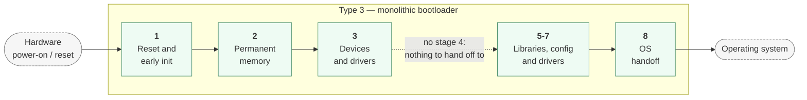

# Boot stages

A boot is a sequence of stages, each setting up what the next one needs. The SoK divides it into eight, and every bootloader page walks its own phases against this model. Not every stage appears everywhere: Type 3 has no stage 4, because there is no second bootloader to hand off to, and Type 1 has no stages 5-8, because it stays OS-agnostic.

```mermaid
%%{init: {"flowchart": {"htmlLabels": true}}}%%
flowchart LR
    HW(["Hardware<br/>power-on / reset"]):::edge --> S1
    subgraph T1["Type 1 &mdash; firmware bootloader"]
        direction LR
        S1["<b>1</b><br/>Reset and<br/>early init"]:::fw --> S2["<b>2</b><br/>Permanent<br/>memory"]:::fw
        S2 --> S3["<b>3</b><br/>Devices<br/>and drivers"]:::fw
        S3 --> S4["<b>4</b><br/>Bootloader<br/>handoff"]:::fw
    end
    S4 --> S5
    subgraph T2["Type 2 &mdash; OS bootloader"]
        direction LR
        S5["<b>5</b><br/>Boot<br/>libraries"]:::os --> S6["<b>6</b><br/>Boot<br/>configuration"]:::os
        S6 --> S7["<b>7</b><br/>Modules and<br/>boot drivers"]:::os
        S7 --> S8["<b>8</b><br/>OS<br/>handoff"]:::os
    end
    S8 --> OS(["Operating system<br/>or hypervisor"]):::edge
    classDef fw fill:#eef3fb,stroke:#4a6fa5;
    classDef os fill:#f3f0fb,stroke:#7a5aa5;
    classDef edge fill:#f6f6f6,stroke:#888,stroke-dasharray:3 3;
```

A Type 3 bootloader spans the same work in one image, with no stage 4 because there is no second bootloader to hand off to:

| Stage | | Present in |
|---|---|---|
| 1 | **Reset and early init.** Execution begins at the reset vector. Temporary memory is established, basic CPU state is set up, and the first integrity check establishes the root of trust. *EDK II SEC, coreboot bootblock, SeaBIOS preinit, U-Boot SoC ROM code.* | Type 1, Type 3 |
| 2 | **Permanent memory.** CPU initialisation is completed and DRAM is brought up, so later stages have real memory to run in. *EDK II PEI, coreboot romstage, U-Boot SPL.* | Type 1, Type 3 |
| 3 | **Device enumeration and drivers.** Buses are walked, devices matched to drivers, platform tables built, and the firmware's services published. *EDK II DXE, coreboot ramstage, SeaBIOS setup.* | Type 1, Type 3 |
| 4 | **Bootloader handoff.** A boot device is selected and the OS bootloader is loaded and entered. *EDK II BDS, SeaBIOS INT 0x19, coreboot's payload jump.* | Type 1 only — absent in Type 3, which has nothing to hand off to |
| 5 | **Boot libraries.** The OS bootloader's own services: filesystem access, memory management, and whatever it needs to read its configuration. *GRUB kernel.img, Windows Boot Manager's boot libraries.* | Type 2, Type 3 |
| 6 | **Boot configuration.** The description of what may be booted is read: entries, kernel arguments, and which extras to load. *grub.cfg, the Windows BCD, U-Boot's bootdev and environment.* | Type 2, Type 3 |
| 7 | **Modules and boot drivers.** Extra code named by the configuration is loaded — filesystem, video, crypto or OS-specific drivers. *GRUB \*.mod modules, Windows boot drivers.* | Type 2, Type 3 |
| 8 | **OS handoff.** The kernel and initrd are loaded, the arguments and tables assembled, firmware resources released, and control transferred. *GRUB core.img, bootmgr.efi, U-Boot's bootflow.* | Type 2, Type 3 |

Implementations vary widely inside a stage. coreboot spreads stage 3 across several components (romstage, postcar, ramstage); EDK II packs the same work into one (DXE). The stage numbers describe *what must happen*, not how a project divides it up.

## How state crosses a stage boundary

### Structured handoff: system tables and interrupts

Type 1 bootloaders publish an explicit interface. UEFI defines system tables exposing Boot Services and Runtime Services, with persistent configuration in NVRAM variables such as `BootOrder` and the Secure Boot keys; PEI reaches DXE through a HOB list. SeaBIOS, following legacy BIOS convention, uses software interrupts and fixed low-memory structures instead — `INT 0x19` to find the next stage, the BIOS Data Area for state. coreboot provides no user-facing interface at all: it builds a coreboot table and leaves the payload to define how anything is configured.

### Dynamic configuration: external files

Type 2 bootloaders move the contract into data. GRUB's `grub.cfg` holds menu entries, kernel arguments and chainload targets; the Windows BCD holds boot paths, recovery modes and drivers, editable at runtime. Because these are files rather than compiled-in values, the boot flow can change — a different root device, an alternate payload, a recovery entry — without rebuilding anything. That flexibility is also why the configuration file is itself an attack surface.

### Static communication: minimal runtime interfaces

Type 3 bootloaders fold initialisation and OS launch into one image and leave few channels open. MCUboot's only runtime channel is the flash layout — image slots and the trailer flags that record a pending, testing or confirmed update. U-Boot is the richer case, offering a shell and an environment that can adjust the bootflow or kernel arguments, but substantial change still means reflashing.

## How control crosses it

### Structured and layered

Type 1 bootloaders use formal transitions. UEFI's BDS phase walks `BootOrder` to find a boot application, loads it with a pointer to the system table, and the application later calls `ExitBootServices()` to release firmware-managed resources. SeaBIOS chains through sector loaders: `INT 0x19` loads the MBR, whose code finds the active partition's volume boot record. coreboot delegates, handing its table to a payload that builds the real system tables itself.

### Configurable OS handoff

Type 2 bootloaders emphasise flexibility. `bootmgr.efi` passes UEFI tables, BCD entries and preloaded drivers to `winload.efi`; GRUB loads a kernel and initrd with a command line it assembled, or chainloads another Type 2 bootloader entirely. Multi-OS booting and runtime reconfiguration come from this stage.

### Direct and minimal

Type 3 bootloaders pass as little as possible. MCUboot verifies an image and jumps to it with nothing passed at all, since everything was fixed at build time. U-Boot passes more — kernel, arguments and a flattened device tree it may have fixed up — but the transfer is still essentially static. Determinism is chosen over extensibility.

## Per-bootloader walkthroughs

Every corpus page carries a **How it boots** section with its own phases, the mechanism that carries state between them, and what it hands over. Six of the paper's seven case studies are in the corpus:

- [coreboot](bootloaders/coreboot) — SoK § 3.3
- [edk2](bootloaders/edk2) — SoK § 3.1
- [grub](bootloaders/grub) — SoK § 3.5
- [mcuboot](bootloaders/mcuboot) — SoK § 3.6
- [seabios](bootloaders/seabios) — SoK § 3.2
- [u-boot](bootloaders/u-boot) — SoK § 3.7

The seventh, Windows Boot Manager, is closed source and so is not in the corpus; its structure is described under stages 5-8 above and in SoK § 3.4.

The remaining 54 pages are written from each project's own documentation and source.
