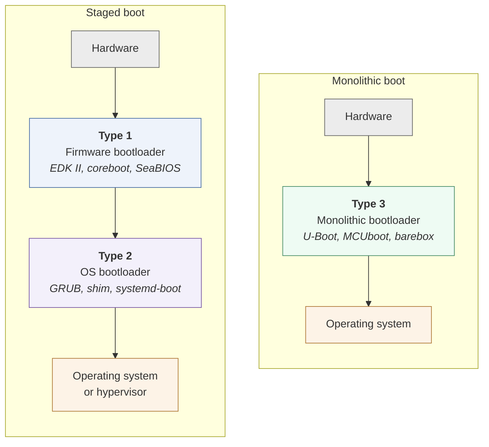

# Bootloader types

BootBench classifies every bootloader by **where it starts** and **what it hands off to**. That is the whole test, and it is why two projects that look similar can land in different types.

## Firmware bootloader (`type1`)

Boots from hardware and presents a hardware-agnostic interface to whatever runs next. It may load another bootloader or a standalone application, but it does not itself prepare an operating system.

**The test:** Starts at the reset vector with nothing initialised. Ends by publishing an interface — UEFI Boot Services, the BIOS interrupt table, the RISC-V SBI — and handing off.

14 in the corpus: [LakeBIOS](bootloaders/LakeBIOS), [coreboot](bootloaders/coreboot), [edk2](bootloaders/edk2), [edk2-platforms](bootloaders/edk2-platforms), [firmware-open](bootloaders/firmware-open), [hostboot](bootloaders/hostboot), [lbmk](bootloaders/lbmk), [mu_basecore](bootloaders/mu_basecore), [openbios](bootloaders/openbios), [openfirmware](bootloaders/openfirmware), [opensbi](bootloaders/opensbi), [oreboot](bootloaders/oreboot), [seabios](bootloaders/seabios), [slimbootloader](bootloaders/slimbootloader)

## OS bootloader (`type2`)

Boots from an already-initialised system and prepares an operating system or hypervisor.

**The test:** Starts with the machine already up. Its job is to find a kernel, load it, and transfer control with the right arguments and tables. This is why Type 2 bootloaders are configuration-driven and often scriptable.

28 in the corpus: [CloverBootloader](bootloaders/CloverBootloader), [MiniVisorPkg](bootloaders/MiniVisorPkg), [OpenCorePkg](bootloaders/OpenCorePkg), [aboot](bootloaders/aboot), [bootboot](bootloaders/bootboot), [bootloader](bootloaders/bootloader), [chameleon](bootloaders/chameleon), [depthcharge](bootloaders/depthcharge), [easyboot](bootloaders/easyboot), [grub](bootloaders/grub), [ipxe](bootloaders/ipxe), [kexec-tools](bootloaders/kexec-tools), [limine](bootloaders/limine), [linuxboot](bootloaders/linuxboot), [lk](bootloaders/lk), [lk2nd](bootloaders/lk2nd), [open-iscsi](bootloaders/open-iscsi), [petitboot](bootloaders/petitboot), [quibble](bootloaders/quibble), [refind](bootloaders/refind), [shim](bootloaders/shim), [skiboot](bootloaders/skiboot), [syslinux](bootloaders/syslinux), [systemd](bootloaders/systemd), [tboot-mirror](bootloaders/tboot-mirror), [tosaithe](bootloaders/tosaithe), [u-root](bootloaders/u-root), [x86-bootloader](bootloaders/x86-bootloader)

## Monolithic bootloader (`type3`)

Combines both jobs: boots directly from hardware into an operating system with no handoff between stages.

**The test:** Starts at reset and ends in the application or kernel. Nothing sits between, so the interfaces a staged boot exposes between stages simply do not exist.

20 in the corpus: [Adafruit_nRF52_Bootloader](bootloaders/Adafruit_nRF52_Bootloader), [IMBootloader](bootloaders/IMBootloader), [STM32duino-bootloader](bootloaders/STM32duino-bootloader), [arduino-variometer](bootloaders/arduino-variometer), [arm-trusted-firmware](bootloaders/arm-trusted-firmware), [barebox](bootloaders/barebox), [firmware](bootloaders/firmware), [harmony](bootloaders/harmony), [katapult](bootloaders/katapult), [mbed-bootloader](bootloaders/mbed-bootloader), [mcuboot](bootloaders/mcuboot), [openblt](bootloaders/openblt), [optiboot](bootloaders/optiboot), [redboot](bootloaders/redboot), [rustBoot](bootloaders/rustBoot), [stm32-mw-openbl](bootloaders/stm32-mw-openbl), [tock-bootloader](bootloaders/tock-bootloader), [trusted-firmware-m](bootloaders/trusted-firmware-m), [u-boot](bootloaders/u-boot), [wolfBoot](bootloaders/wolfBoot)

## Staged versus monolithic booting

Type 1 and Type 2 chained together are *staged booting* — modular and hardware-abstracting, at the cost of firmware size and start-up time, and typical of desktops, servers and phones. Type 3 is *monolithic booting* — smaller and faster but tightly coupled to the board, and typical of IoT devices and microcontrollers.

## Where the classification is arguable

A few projects genuinely straddle the line, and their pages say so rather than presenting the placement as settled:

- **arm-trusted-firmware** spans reset to OS handoff, so it is Type 3 here — but in a staged setup where BL33 is U-Boot it behaves as Type 1.
- **lk** is Type 2 as Qualcomm's aboot, running after the SoC's primary bootloader; on platforms where it is the only stage it is Type 3.
- **open-iscsi** is boot-path infrastructure rather than a bootloader that transfers control to a kernel. It is the weakest fit in the corpus.
