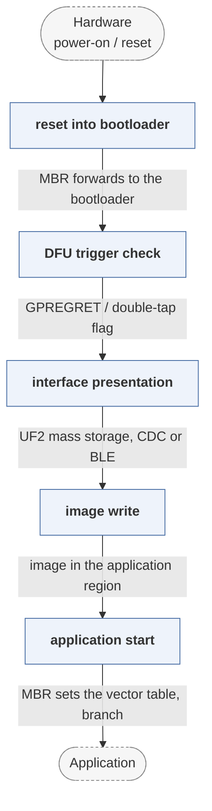

# Adafruit_nRF52_Bootloader

*UF2 and DFU bootloader for nRF52 boards.*

| | |
|---|---|
| Type | **Monolithic bootloader** (type3) |
| Upstream | https://github.com/adafruit/Adafruit_nRF52_Bootloader |
| CVEs attributed | 0 |
| Vulnerability-fixing commits | 0 naming a CVE, 4 keyword-matched |
| CVEs with a linked fix | 0 |

## What it does at boot

Presents a USB mass-storage device for drag-and-drop firmware update, then starts the application.

## Why it is Type 3

Type 3: reset to application.

## How it boots

See [Boot-Stages](Boot-Stages) for the eight-stage model these phases map onto.



1. **reset into bootloader** -- The nRF52 starts in the bootloader region; the MBR at the bottom of flash handles vector forwarding.
2. **DFU trigger check** -- Enters update mode on a double-tap reset, a GPIO condition, or a request left by the application in a retained register.
3. **interface presentation** -- Presents itself as a USB mass-storage device for UF2 drag-and-drop, a CDC serial port for nrfutil DFU, or over BLE.
4. **image write** -- Writes the received image into the application region, checking the package's CRC and, for nrfutil packages, its signature.
5. **application start** -- Sets the vector table through the MBR and starts the application.

### Passing data between stages

The channel between application and bootloader is the nRF52's retained GPREGRET register plus a double-tap flag in RAM, which survive a soft reset -- that is how an application asks to be re-entered into DFU without a physical button. UF2 itself is a deliberately simple container: 512-byte blocks each carrying their own target address and block count, so a file copy onto a mass-storage device is a valid flashing protocol even though the OS believes it is writing to FAT.

### Handoff

Control passes to the application through the Nordic MBR, which owns the real vector table and forwards interrupts to whichever image is running. Nothing else is passed. The UF2 path performs no signature check, which is the trade made for making firmware updates a drag-and-drop operation.

## Security mechanisms

None detected. That means no matching pattern was found in its build configuration or source, not that the project is insecure -- a small MCU bootloader may simply have nothing to configure.

## Analysing it

```bash
git -C oss-bootloaders submodule update --init type3/Adafruit_nRF52_Bootloader
./scripts/analysis/run-tool.sh codeql Adafruit_nRF52_Bootloader
```

See [Tools](Tools) for what each tool applies to.

---

[Home](Home) · [Monolithic bootloader](Bootloader-Types) · [Tools](Tools)
