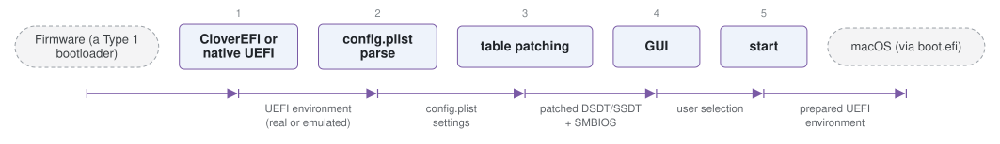

# CloverBootloader

*Clover, an earlier macOS-focused UEFI bootloader.*

| | |
|---|---|
| Type | **OS bootloader** (type2) |
| Upstream | https://github.com/CloverHackyColor/CloverBootloader |
| CVEs attributed | 2 |
| Vulnerability-fixing commits | 0 naming a CVE, 5 keyword-matched |
| CVEs with a linked fix | 0 |

## What it does at boot

Similar role to OpenCore, with its own patching model.

## Why it is Type 2

Type 2: a UEFI application that launches an OS.

## How it boots

See [Boot-Stages](Boot-Stages) for the eight-stage model these phases map onto.



1. **CloverEFI or native UEFI** -- On legacy BIOS machines CloverEFI provides a UEFI emulation layer first; on UEFI machines CLOVERX64.efi is loaded directly.
2. **config.plist parse** -- Configuration for patches, SMBIOS, devices and the GUI is read from a property list.
3. **table patching** -- ACPI is patched (DSDT fixes, SSDT injection) and SMBIOS is rewritten.
4. **GUI** -- A themed boot picker scans volumes and lists the operating systems it recognises.
5. **start** -- boot.efi is launched for macOS, or another loader is chainloaded.

### Passing data between stages

Clover predates OpenCore and takes a broader approach: as well as patching tables and injecting drivers, it can supply the UEFI environment itself on machines that have none, which is why the tree carries a large slice of EDK II. Configuration and the same interception channels -- ACPI, SMBIOS, NVRAM, device properties -- are the mechanism, with more automatic fixups applied by default than OpenCore's explicitly-listed quirks.

### Handoff

As with OpenCore, macOS is reached through Apple's `boot.efi` and other systems through a UEFI chainload. The wider surface is the trade: more is patched on the machine's behalf, and more of the firmware environment is Clover's own code rather than the platform's.

## Most common weaknesses

| CWE | CVEs |
|---|---:|
| CWE-787 | 1 |
| CWE-125 | 1 |

## Security mechanisms

Detected in its build configuration and source:

- aslr
- encryption
- fortify
- measured boot
- rollback protection
- secure boot
- signature verification
- stack protector

See [Security-Mechanisms](Security-Mechanisms) for how these are detected and what a detection does and does not prove.

## Analysing it

```bash
git -C oss-bootloaders submodule update --init type2/CloverBootloader
./scripts/analysis/run-tool.sh codeql CloverBootloader
```

See [Tools](Tools) for what each tool applies to.

---

[Home](Home) · [OS bootloader](Bootloader-Types) · [Tools](Tools)
