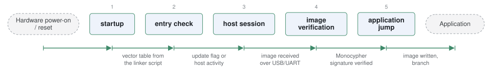

# IMBootloader

*IMProject bootloader for STM32.*

| | |
|---|---|
| Type | **Monolithic bootloader** (type3) |
| Upstream | https://github.com/IMProject/IMBootloader |
| CVEs attributed | 0 |
| Vulnerability-fixing commits | 0 naming a CVE, 0 keyword-matched |
| CVEs with a linked fix | 0 |

## What it does at boot

CRC-checked firmware update over UART or USB, then application start.

## Why it is Type 3

Type 3: reset to application.

## How it boots

See [Boot-Stages](Boot-Stages) for the eight-stage model these phases map onto.



1. **startup** -- Vendor startup code and the linker script place the bootloader at the base of flash.
2. **entry check** -- Decides whether to enter update mode based on a flag or host activity.
3. **host session** -- Talks to the IMFlasher host tool over USB or UART.
4. **verification** -- Checks the image signature using Monocypher before accepting it.
5. **application jump** -- Writes the image to the application region and jumps to it.

### Passing data between stages

The design goal is that one bootloader plus one host tool serve every supported MCU, so the board differences are pushed into the Drivers and Linker directories and the protocol above them stays fixed. Monocypher provides the signature check in a small enough footprint to fit alongside the rest. Update metadata travels in the protocol rather than in a flash header.

### Handoff

Nothing is passed to the application beyond the vector table relocation. Its interest in the corpus is as a small, current example of a signed-update bootloader that is explicitly designed to be reused across MCU families.

## Security mechanisms

Detected in its build configuration and source:

- encryption
- signature verification

See [Security-Mechanisms](Security-Mechanisms) for how these are detected and what a detection does and does not prove.

## Analysing it

```bash
git -C oss-bootloaders submodule update --init type3/IMBootloader
./scripts/analysis/run-tool.sh codeql IMBootloader
```

See [Tools](Tools) for what each tool applies to.

---

[Home](Home) · [Monolithic bootloader](Bootloader-Types) · [Tools](Tools)
