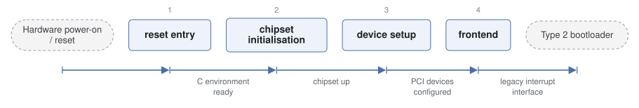

# LakeBIOS

*Minimal experimental x86 BIOS implementation.*

| | |
|---|---|
| Type | **Firmware bootloader** (type1) |
| Upstream | https://github.com/AtieP/LakeBIOS |
| CVEs attributed | 0 |
| Vulnerability-fixing commits | 0 naming a CVE, 0 keyword-matched |
| CVEs with a linked fix | 0 |

## What it does at boot

Brings up a QEMU-class machine and provides a minimal BIOS interface.

## Why it is Type 1

Type 1: firmware-level bring-up from reset.

## How it boots

See [Boot-Stages](Boot-Stages) for the eight-stage model these phases map onto.



1. **reset entry** -- Executes from the reset vector in flash and sets up an environment for C code.
2. **chipset initialisation** -- Brings up the emulated northbridge/southbridge -- QEMU I440FX-PIIX and Q35-ICH9 are the supported targets.
3. **device setup** -- Enumerates and configures PCI devices, bridges, disk controllers and displays through a hardware abstraction layer.
4. **frontend** -- A legacy BIOS frontend presents the interface the next stage expects; UEFI- style services are a work in progress.

### Passing data between stages

LakeBIOS is a small, deliberately modular reimplementation, and its internal boundary is the HAL rather than a table format. Where it presents a legacy frontend, communication with the next stage follows the BIOS conventions -- interrupt vectors and fixed low-memory structures -- described under [seabios](bootloaders/seabios).

### Handoff

As a legacy frontend it chainloads through the boot sector in the usual way. It is a research and teaching implementation rather than production firmware, so its value in this corpus is as a minimal, readable example of the Type 1 structure.

## Security mechanisms

None detected. That means no matching pattern was found in its build configuration or source, not that the project is insecure -- a small MCU bootloader may simply have nothing to configure.

## Analysing it

```bash
git -C oss-bootloaders submodule update --init type1/LakeBIOS
./scripts/analysis/run-tool.sh codeql LakeBIOS
```

See [Tools](Tools) for what each tool applies to.

---

[Home](Home) · [Firmware bootloader](Bootloader-Types) · [Tools](Tools)
