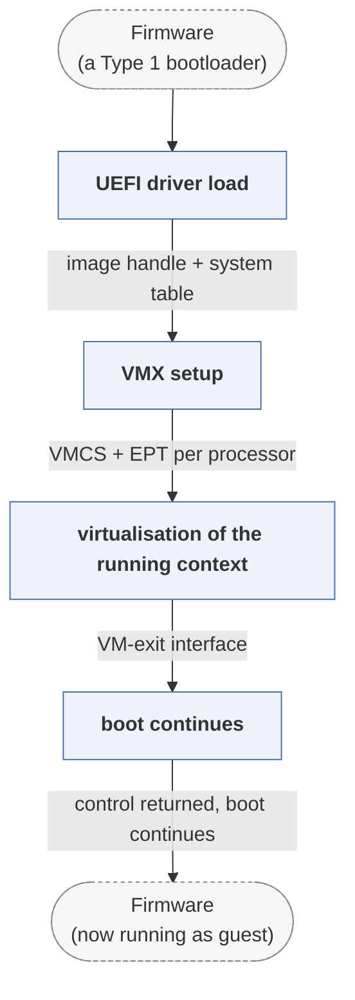

# MiniVisorPkg

*Minimal research hypervisor loadable from UEFI.*

| | |
|---|---|
| Type | **OS bootloader** (type2) |
| Upstream | https://github.com/tandasat/MiniVisorPkg |
| CVEs attributed | 0 |
| Vulnerability-fixing commits | 0 naming a CVE, 0 keyword-matched |
| CVEs with a linked fix | 0 |

## What it does at boot

Installs a thin hypervisor before the OS boots.

## Why it is Type 2

Type 2: a UEFI-loaded stage that runs before and hands off to an OS.

## How it boots

See [Boot-Stages](Boot-Stages) for the eight-stage model these phases map onto.



1. **UEFI driver load** -- MiniVisor is loaded as a UEFI driver, typically from the UEFI shell, before any OS starts.
2. **VMX setup** -- Enables VMX operation, allocates VMCS and EPT structures for each processor.
3. **virtualisation of the running context** -- The currently executing environment -- the firmware -- becomes the guest, with the hypervisor beneath it.
4. **boot continues** -- The firmware and then the OS continue running as a guest, observed by the hypervisor.

### Passing data between stages

This is not a bootloader in the sense of loading anything; it is in the corpus because it occupies the boot path. Its communication with what runs above it is the VM-exit interface: the guest's privileged operations trap into the hypervisor, which logs or modifies them. As a Windows driver build it uses the same core with a different loader, so the same code can be debugged with WinDbg.

### Handoff

There is no handoff -- control returns to the firmware, which proceeds to the real boot. The relevance to bootloader security is that code installed this early sits underneath everything the OS can inspect, which is precisely the position a bootkit wants.

## Security mechanisms

None detected. That means no matching pattern was found in its build configuration or source, not that the project is insecure -- a small MCU bootloader may simply have nothing to configure.

## Analysing it

```bash
git -C oss-bootloaders submodule update --init type2/MiniVisorPkg
./scripts/analysis/run-tool.sh codeql MiniVisorPkg
```

See [Tools](Tools) for what each tool applies to.

---

[Home](Home) · [OS bootloader](Bootloader-Types) · [Tools](Tools)
