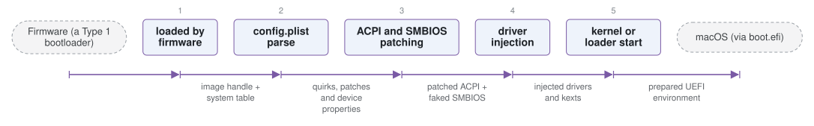

# OpenCorePkg

*OpenCore, a UEFI bootloader for running macOS on unsupported hardware.*

| | |
|---|---|
| Type | **OS bootloader** (type2) |
| Upstream | https://github.com/acidanthera/OpenCorePkg |
| CVEs attributed | 1 |
| Vulnerability-fixing commits | 1 naming a CVE, 26 keyword-matched |
| CVEs with a linked fix | 0 |

## What it does at boot

Injects ACPI, kext and SMBIOS patches, then boots macOS, Windows or Linux.

## Why it is Type 2

Type 2: a UEFI application that prepares and launches an OS.

## How it boots

See [Boot-Stages](Boot-Stages) for the eight-stage model these phases map onto.



1. **loaded by firmware** -- OpenCore.efi is loaded from the ESP as a UEFI application, or chainloaded from another loader.
2. **config.plist parse** -- A single property list drives everything: ACPI patches, kernel extensions, device properties, quirks and the boot picker.
3. **ACPI and SMBIOS patching** -- Tables are added, dropped or patched before the OS sees them, and SMBIOS is rewritten to match a supported Mac model.
4. **driver injection** -- UEFI drivers are loaded for filesystems (APFS, HFS+) and missing firmware features.
5. **kernel or loader start** -- boot.efi is started for macOS, with kext injection and kernel patches applied on the way, or another OS is chainloaded.

### Passing data between stages

OpenCore's job is to make a non-Apple machine present the environment macOS expects, so almost all of its communication is interception: it patches the ACPI tables and SMBIOS the firmware built, injects device properties into the tree, and applies binary patches to the kernel and to kexts as they are loaded. NVRAM is the other channel -- `boot-args`, the boot device path and Apple-specific variables are written there, and OpenCore can emulate NVRAM on firmware that does not persist it properly.

### Handoff

For macOS, control goes to Apple's own `boot.efi`, which OpenCore has already prepared the environment for; boot.efi then starts the kernel. For Windows or Linux it is an ordinary UEFI chainload. Because the patches are applied in memory rather than on disk, the installed OS is unmodified -- which is what makes updates survivable.

## Attack surfaces seen in its CVEs

| Surface | | CVEs |
|---|---|---:|
| `SAS1` | Remote access (software) | 1 |

## Security mechanisms

Detected in its build configuration and source:

- cfi
- secure boot
- stack protector

See [Security-Mechanisms](Security-Mechanisms) for how these are detected and what a detection does and does not prove.

## Analysing it

```bash
git -C oss-bootloaders submodule update --init type2/OpenCorePkg
./scripts/analysis/run-tool.sh codeql OpenCorePkg
```

See [Tools](Tools) for what each tool applies to.

---

[Home](Home) · [OS bootloader](Bootloader-Types) · [Tools](Tools)
