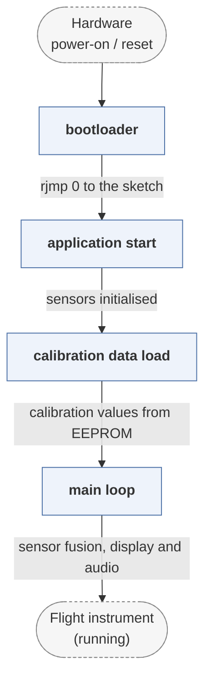

# arduino-variometer

*Arduino variometer project including its bootloader.*

| | |
|---|---|
| Type | **Monolithic bootloader** (type3) |
| Upstream | https://github.com/prunkdump/arduino-variometer |
| CVEs attributed | 0 |
| Vulnerability-fixing commits | 0 naming a CVE, 0 keyword-matched |
| CVEs with a linked fix | 0 |

## What it does at boot

Application firmware with a small bootloader for a flight instrument.

## Why it is Type 3

Type 3: reset to application on AVR.

## How it boots

See [Boot-Stages](Boot-Stages) for the eight-stage model these phases map onto.



1. **bootloader** -- A stock AVR bootloader (Optiboot or similar) occupies the boot section and provides serial programming.
2. **application start** -- The variometer firmware starts and initialises its sensors -- barometer, accelerometer, magnetometer, GPS.
3. **calibration data load** -- Calibration values are read from EEPROM, where the separate calibration sketches in this repository wrote them.
4. **main loop** -- Runs the flight instrument: sensor fusion, display and audio output, logging.

### Passing data between stages

This project is application firmware with a conventional AVR bootloader beneath it, and the only state crossing that boundary is EEPROM: calibration written by one sketch is read by another. It is included in the corpus as a worked example of the Type 3 pattern at its simplest -- reset goes to a small serial-programmable loader, which goes to an application that owns the device -- rather than for the bootloader being novel.

### Handoff

The jump to the application is the AVR bootloader's `rjmp` to address 0, with nothing passed. There is no verification anywhere in the path.

## Security mechanisms

None detected. That means no matching pattern was found in its build configuration or source, not that the project is insecure -- a small MCU bootloader may simply have nothing to configure.

## Analysing it

```bash
git -C oss-bootloaders submodule update --init type3/arduino-variometer
./scripts/analysis/run-tool.sh codeql arduino-variometer
```

See [Tools](Tools) for what each tool applies to.

---

[Home](Home) · [Monolithic bootloader](Bootloader-Types) · [Tools](Tools)
