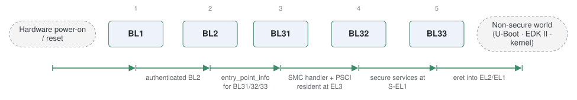

# arm-trusted-firmware

*Trusted Firmware-A, the Arm secure-world reference.*

| | |
|---|---|
| Type | **Monolithic bootloader** (type3) |
| Upstream | https://github.com/ARM-software/arm-trusted-firmware |
| CVEs attributed | 12 |
| Vulnerability-fixing commits | 60 naming a CVE, 96 keyword-matched |
| CVEs with a linked fix | 2 |

## What it does at boot

BL1/BL2/BL31 bring the SoC up from reset, set up EL3 runtime services, then enter the normal-world bootloader or OS.

## Why it is Type 3

Type 3 in this corpus: it spans reset to OS handoff. Arguably Type 1 in a staged setup where BL33 is U-Boot.

## How it boots

See [Boot-Stages](Boot-Stages) for the eight-stage model these phases map onto.



1. **BL1** -- Runs from ROM at reset in EL3. Sets up the exception vectors and minimal platform state, then loads and authenticates BL2.
2. **BL2** -- Trusted boot firmware. Initialises DRAM, then loads and authenticates every image that follows: BL31, BL32 and BL33.
3. **BL31** -- The EL3 runtime firmware. Installs the SMC handler, PSCI implementation and interrupt routing, and stays resident for the life of the system.
4. **BL32** -- Optional secure-world payload -- OP-TEE, TF-M or another trusted OS -- running in S-EL1.
5. **BL33** -- The non-secure bootloader: U-Boot, EDK II or a kernel, entered in EL2 or EL1.

### Passing data between stages

Images are described to each other by `entry_point_info` and `image_info` structures that BL2 fills in and passes through BL31's initialisation -- that is how BL31 knows where BL32 and BL33 should start and in which exception level. Authentication is driven by a chain of trust expressed as certificates in the FIP (Firmware Image Package), so each stage verifies the next against keys rooted in the ROTPK held in OTP. After boot, the interface is the SMC calling convention: PSCI calls for CPU power management, and SMCs into the trusted OS.

### Handoff

BL31 does not hand control away and disappear. It `eret`s into BL33 at the exception level configured for it, and remains at EL3 to service SMCs -- so the normal-world bootloader and later the OS keep calling back into it for CPU_ON, system reset and secure services. This is why TF-A behaves as both a boot stage and a runtime component.

## Most common weaknesses

| CWE | CVEs |
|---|---:|
| CWE-1284 | 2 |
| CWE-787 | 1 |
| CWE-191 | 1 |
| CWE-682 | 1 |
| CWE-123 | 1 |
| CWE-120 | 1 |

## Security mechanisms

Detected in its build configuration and source:

- cfi
- encryption
- measured boot
- rollback protection
- secure boot
- signature verification
- stack protector

See [Security-Mechanisms](Security-Mechanisms) for how these are detected and what a detection does and does not prove.

## Reproducible vulnerabilities

Each of these resolves to a fixing commit and to the parent revision that still contains the bug:

| CVE | Fix | Vulnerable revision |
|---|---|---|
| CVE-2017-15031 | `87d35d933d` | `494d57e8b8` |
| CVE-2017-15031 | `c605ecd1a1` | `a74e3a16b5` |

```bash
git -C oss-bootloaders/type3/arm-trusted-firmware checkout <vulnerable revision>
```

## Analysing it

```bash
git -C oss-bootloaders submodule update --init type3/arm-trusted-firmware
./scripts/analysis/run-tool.sh codeql arm-trusted-firmware
```

See [Tools](Tools) for what each tool applies to.

---

[Home](Home) · [Monolithic bootloader](Bootloader-Types) · [Tools](Tools)
