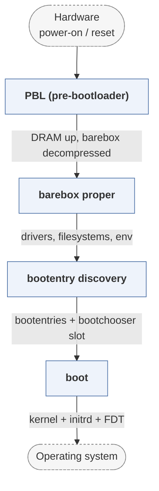

# barebox

*U-Boot alternative with a Linux-like driver model.*

| | |
|---|---|
| Type | **Monolithic bootloader** (type3) |
| Upstream | https://github.com/barebox/barebox |
| CVEs attributed | 13 |
| Vulnerability-fixing commits | 6 naming a CVE, 265 keyword-matched |
| CVEs with a linked fix | 0 |

## What it does at boot

Initialises the board from reset and boots a kernel, with a shell and a filesystem-like device model.

## Why it is Type 3

Type 3: hardware bring-up and OS launch in one image.

## How it boots

See [Boot-Stages](Boot-Stages) for the eight-stage model these phases map onto.



1. **PBL (pre-bootloader)** -- A small compressed prologue that runs from SRAM, sets up DRAM, and decompresses barebox proper into it.
2. **barebox proper** -- Full initialisation: driver model, filesystem layer, network stack, and the shell.
3. **bootentry discovery** -- Boot entries are collected from bootloader spec files, scripts in /env/boot, or the device tree.
4. **boot** -- The chosen entry loads a kernel, device tree and initrd, and starts it.

### Passing data between stages

barebox follows U-Boot's role but borrows the kernel's design: a POSIX- like filesystem layer where devices, variables and configuration all appear as files, so a boot script manipulates `/env/` and `/dev/` with ordinary shell commands. State the PBL gathers before DRAM exists is passed to the main image in handoff data. The state that matters most across reboots is the bootchooser's: per-slot priority and remaining- attempts counters, stored in persistent storage and decremented on each try, so a failed update rolls back automatically.

### Handoff

The kernel is entered with the device tree barebox assembled and fixed up, following the same ARM/RISC-V protocol U-Boot uses. barebox also implements enough of UEFI to start an EFI stub kernel, and can run as an EFI application itself.

## Attack surfaces seen in its CVEs

| Surface | | CVEs |
|---|---|---:|
| `SAS1` | Remote access (software) | 4 |
| `SAS2` | Persistent data source (software) | 3 |
| `HAS2` | External hardware (hardware) | 2 |

## Most common weaknesses

| CWE | CVEs |
|---|---:|
| CWE-190 | 3 |
| CWE-125 | 2 |
| CWE-345 | 1 |
| CWE-835 | 1 |
| CWE-346 | 1 |

## Security mechanisms

Detected in its build configuration and source:

- encryption
- fortify
- measured boot
- rollback protection
- secure boot
- signature verification
- stack protector

See [Security-Mechanisms](Security-Mechanisms) for how these are detected and what a detection does and does not prove.

## Analysing it

```bash
git -C oss-bootloaders submodule update --init type3/barebox
./scripts/analysis/run-tool.sh codeql barebox
```

See [Tools](Tools) for what each tool applies to.

---

[Home](Home) · [Monolithic bootloader](Bootloader-Types) · [Tools](Tools)
