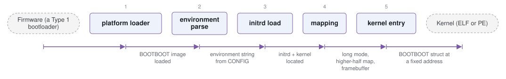

# bootboot

*Multi-architecture boot protocol and reference loaders.*

| | |
|---|---|
| Type | **OS bootloader** (type2) |
| Upstream | https://gitlab.com/bztsrc/bootboot |
| CVEs attributed | 0 |
| Vulnerability-fixing commits | 0 naming a CVE, 0 keyword-matched |
| CVEs with a linked fix | 0 |

## What it does at boot

Provides a uniform machine state to the kernel across BIOS, UEFI and RPi.

## Why it is Type 2

Type 2: implements a protocol for handing off to an OS kernel.

## How it boots

See [Boot-Stages](Boot-Stages) for the eight-stage model these phases map onto.



1. **platform loader** -- A per-platform first stage -- BIOS, UEFI application, coreboot payload or Raspberry Pi start.elf -- loads the BOOTBOOT image.
2. **environment parse** -- Reads BOOTBOOT/CONFIG, a plain text key-value file on the boot partition.
3. **initrd load** -- Locates the initial ramdisk and finds the kernel inside it (ELF or PE, at a fixed path).
4. **mapping** -- Sets up long mode, identity and higher-half mappings, and the framebuffer.
5. **kernel entry** -- Enters the kernel on all cores with a defined environment.

### Passing data between stages

BOOTBOOT is a protocol first and an implementation second: its contract is a single `BOOTBOOT` structure at a fixed virtual address, describing the memory map, framebuffer, initrd location, SMP core count and the real-time clock, alongside the environment string parsed from CONFIG. Because every platform implementation produces the same structure, a kernel written against it boots unchanged on BIOS, UEFI, coreboot and Raspberry Pi -- the differences are absorbed by the loader.

### Handoff

The kernel is entered in 64-bit mode with paging already configured and the same static addresses on every core, so it does not have to parse anything or bring up SMP itself. This is deliberately more prepared a handoff than Multiboot's, and it is the reason BOOTBOOT is aimed at hobby kernels.

## Security mechanisms

None detected. That means no matching pattern was found in its build configuration or source, not that the project is insecure -- a small MCU bootloader may simply have nothing to configure.

## Analysing it

```bash
git -C oss-bootloaders submodule update --init type2/bootboot
./scripts/analysis/run-tool.sh codeql bootboot
```

See [Tools](Tools) for what each tool applies to.

---

[Home](Home) · [OS bootloader](Bootloader-Types) · [Tools](Tools)
