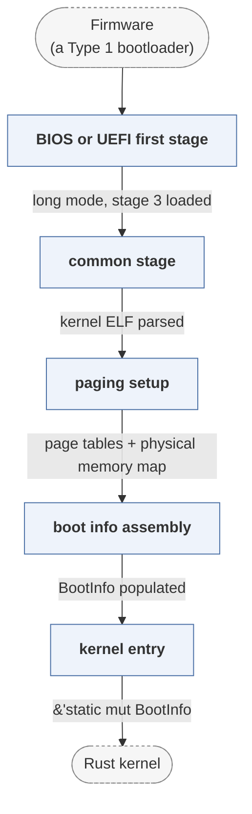

# bootloader

*rust-osdev/bootloader, a Rust x86_64 kernel loader.*

| | |
|---|---|
| Type | **OS bootloader** (type2) |
| Upstream | https://github.com/rust-osdev/bootloader |
| CVEs attributed | 0 |
| Vulnerability-fixing commits | 0 naming a CVE, 0 keyword-matched |
| CVEs with a linked fix | 0 |

## What it does at boot

Loads a Rust kernel from BIOS or UEFI and sets up paging before handoff.

## Why it is Type 2

Type 2: it starts from an initialised platform and prepares a kernel.

## How it boots

See [Boot-Stages](Boot-Stages) for the eight-stage model these phases map onto.



1. **BIOS or UEFI first stage** -- On BIOS a 512-byte stage loads stage 2 and stage 3, which switch to protected then long mode; on UEFI the firmware loads the bootloader directly.
2. **common stage** -- Shared Rust code takes over: it reads the kernel ELF from the disk image.
3. **paging setup** -- Builds page tables, maps the kernel, and optionally maps all physical memory at a configurable offset.
4. **boot info assembly** -- Fills in a BootInfo struct with the memory map, framebuffer, physical memory offset and ACPI pointer.
5. **kernel entry** -- Jumps to the kernel entry point with a reference to BootInfo.

### Passing data between stages

The interesting property is that the handoff is typed. The bootloader and the kernel are both Rust crates that share the `bootloader_api` crate, so the `BootInfo` structure the loader fills in is the same definition the kernel destructures -- an ABI mismatch becomes a compile error rather than a corrupted pointer. Configuration is done at build time through the API's `BootloaderConfig`, not through a file read at boot.

### Handoff

The kernel is entered in long mode with its page tables installed and a `&'static mut BootInfo` as its argument. On UEFI, `ExitBootServices()` has already been called and the memory map captured into that structure.

## Security mechanisms

Detected in its build configuration and source:

- rollback protection
- stack protector

See [Security-Mechanisms](Security-Mechanisms) for how these are detected and what a detection does and does not prove.

## Analysing it

```bash
git -C oss-bootloaders submodule update --init type2/bootloader
./scripts/analysis/run-tool.sh codeql bootloader
```

See [Tools](Tools) for what each tool applies to.

---

[Home](Home) · [OS bootloader](Bootloader-Types) · [Tools](Tools)
