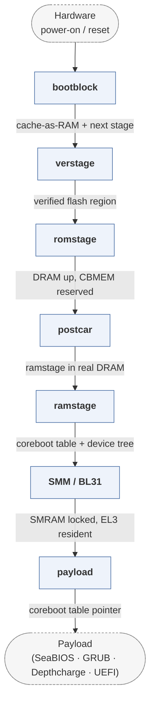

# coreboot

*Open-source replacement for proprietary x86 firmware.*

| | |
|---|---|
| Type | **Firmware bootloader** (type1) |
| Upstream | https://github.com/coreboot/coreboot |
| CVEs attributed | 1 |
| Vulnerability-fixing commits | 1 naming a CVE, 312 keyword-matched |
| CVEs with a linked fix | 0 |

## What it does at boot

Runs from the reset vector, performs raw silicon and DRAM init, then hands control to a payload (SeaBIOS, GRUB, Linux, Tianocore) that does the OS- facing work.

## Why it is Type 1

Type 1: it starts from hardware with nothing initialised and deliberately does not load an OS itself -- the payload split is the defining Type 1 handoff.

## How it boots

The SoK paper gives a full case study of this bootloader in section 3.3. See [Boot-Stages](Boot-Stages) for the eight-stage model these phases map onto.



1. **bootblock** -- First code after the reset vector. Sets up temporary memory -- cache-as-RAM on x86 -- and loads the next stage from flash.
2. **verstage** -- Optional. Verifies the updatable portion of flash before it is used, establishing the root of trust.
3. **romstage** -- Initialises the memory controller and brings up DRAM, then early chipset setup.
4. **postcar** -- x86 only. Tears down cache-as-RAM now that real DRAM exists, and loads ramstage into it.
5. **ramstage** -- The bulk of initialisation: multiprocessor bring-up, PCI enumeration, device drivers, and construction of the coreboot table.
6. **SMM / BL31** -- Installs the trusted-firmware component -- System Management Mode on x86, or ARM Trusted Firmware BL31 on ARM -- into memory the OS cannot reach.
7. **payload** -- Loads and jumps to the payload, which may be a Type 1 bootloader (a UEFI stub) or a Type 2 one (SeaBIOS, GRUB, Depthcharge).

### Passing data between stages

coreboot exposes no interface of its own. State reaches later stages through CBMEM, a region carved out of the top of DRAM in romstage and kept alive afterwards, and through the coreboot table built in ramstage: memory ranges, serial configuration, framebuffer, and on Chromebooks the vboot handoff and GPIO configuration. The device tree, generated at build time from the mainboard's `devicetree.cb`, carries the static hardware description. Anything user-facing -- NVRAM variables, an interactive menu -- is supplied by the payload, not by coreboot.

### Handoff

ramstage loads the payload and jumps to it with a pointer to the coreboot table. How much is in that table depends on who is receiving it: a Depthcharge payload is given the full set because it is already a Type 2 loader, while a UEFI payload is given little more than memory ranges and a framebuffer because it rebuilds its own system tables from the DXE phase onward. coreboot ships `libpayload` and `BlParseLib` so the payload does not have to parse the table itself.

## Attack surfaces seen in its CVEs

| Surface | | CVEs |
|---|---|---:|
| `SAS3` | Post-boot features (software) | 1 |

## Security mechanisms

Detected in its build configuration and source:

- measured boot
- rollback protection
- secure boot

See [Security-Mechanisms](Security-Mechanisms) for how these are detected and what a detection does and does not prove.

## Analysing it

```bash
git -C oss-bootloaders submodule update --init type1/coreboot
./scripts/analysis/run-tool.sh codeql coreboot
```

See [Tools](Tools) for what each tool applies to.

---

[Home](Home) · [Firmware bootloader](Bootloader-Types) · [Tools](Tools)
