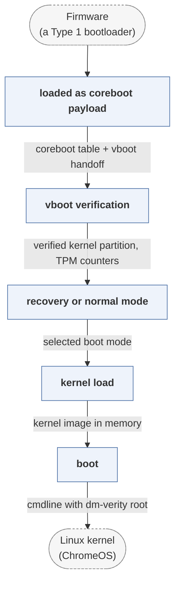

# depthcharge

*ChromeOS bootloader, a coreboot payload.*

| | |
|---|---|
| Type | **OS bootloader** (type2) |
| Upstream | https://chromium.googlesource.com/chromiumos/platform/depthcharge/ |
| CVEs attributed | 0 |
| Vulnerability-fixing commits | 0 naming a CVE, 18 keyword-matched |
| CVEs with a linked fix | 0 |

## What it does at boot

Implements Chrome OS verified boot, selects a kernel partition and boots it.

## Why it is Type 2

Type 2: it is the payload that coreboot (Type 1) hands off to, and it prepares an OS.

## How it boots

See [Boot-Stages](Boot-Stages) for the eight-stage model these phases map onto.



1. **loaded as coreboot payload** -- coreboot's ramstage loads depthcharge and passes it the coreboot table, including the vboot handoff block.
2. **vboot verification** -- Verifies the kernel partition signature against keys in the GBB and the TPM's rollback counters.
3. **recovery or normal mode** -- Chooses between normal boot, developer mode, and recovery from removable media, based on the firmware switches.
4. **kernel load** -- Loads the signed kernel partition from eMMC, NVMe or USB.
5. **boot** -- Assembles the command line and starts the kernel.

### Passing data between stages

Depthcharge is built for one platform family, so it takes far more from coreboot than a general payload does: the coreboot table it receives carries GPIO configuration, board identity and the vboot handoff structure recording what verstage already decided. Rollback protection is anchored in TPM NVRAM -- the kernel version in the signed header must be at least the value stored there -- so the state that matters most between boots lives in the TPM rather than in flash. ChromeOS's A/B partitioning and the `successful`/`tries` GPT attribute bits are what the update system and the bootloader use to agree on which slot to trust.

### Handoff

The kernel is entered directly with a command line that names the verified root and its dm-verity hash tree, so integrity checking continues into the running system. There is no Type 2 loader in between and no menu; the disk layout and the signature decide.

## Security mechanisms

Detected in its build configuration and source:

- measured boot
- rollback protection
- secure boot

See [Security-Mechanisms](Security-Mechanisms) for how these are detected and what a detection does and does not prove.

## Analysing it

```bash
git -C oss-bootloaders submodule update --init type2/depthcharge
./scripts/analysis/run-tool.sh codeql depthcharge
```

See [Tools](Tools) for what each tool applies to.

---

[Home](Home) · [OS bootloader](Bootloader-Types) · [Tools](Tools)
