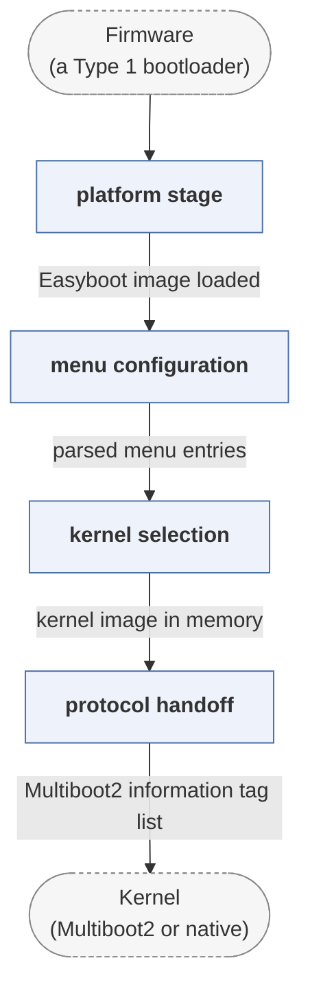

# easyboot

*Multi-kernel boot manager built on the BOOTBOOT protocol.*

| | |
|---|---|
| Type | **OS bootloader** (type2) |
| Upstream | https://gitlab.com/bztsrc/easyboot |
| CVEs attributed | 0 |
| Vulnerability-fixing commits | 0 naming a CVE, 0 keyword-matched |
| CVEs with a linked fix | 0 |

## What it does at boot

Presents a menu and boots kernels in several formats.

## Why it is Type 2

Type 2: OS selection and launch.

## How it boots

See [Boot-Stages](Boot-Stages) for the eight-stage model these phases map onto.



1. **platform stage** -- A BIOS, UEFI, coreboot or Raspberry Pi first stage loads the Easyboot image.
2. **menu configuration** -- Reads a simple plain-text menu file from the boot partition.
3. **kernel selection** -- Presents entries and loads the chosen kernel, in ELF, PE or a.out form.
4. **protocol handoff** -- Boots it with Multiboot2 or the kernel's own expected protocol.

### Passing data between stages

Easyboot is a boot manager built around the idea that the configuration should be readable and the loader should not need plugins: filesystem and format support are compiled in, and a single text file describes the menu. Where a kernel asks for Multiboot2 it receives the standard information tag list -- memory map, module list, framebuffer, ACPI pointers -- which is the mechanism the paper describes for GRUB's Multiboot path.

### Handoff

The kernel is entered with the Multiboot2 information structure in the register the specification defines, or, for kernels that ask for it, in the simpler arrangement its smaller sibling Simpleboot uses. Like BOOTBOOT, from the same author, its goal is that one loader image works across firmware types without the kernel noticing.

## Security mechanisms

Detected in its build configuration and source:

- secure boot

See [Security-Mechanisms](Security-Mechanisms) for how these are detected and what a detection does and does not prove.

## Analysing it

```bash
git -C oss-bootloaders submodule update --init type2/easyboot
./scripts/analysis/run-tool.sh codeql easyboot
```

See [Tools](Tools) for what each tool applies to.

---

[Home](Home) · [OS bootloader](Bootloader-Types) · [Tools](Tools)
