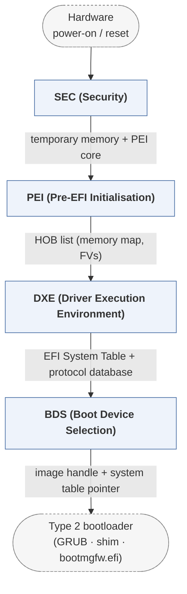

# edk2

*TianoCore's reference implementation of UEFI.*

| | |
|---|---|
| Type | **Firmware bootloader** (type1) |
| Upstream | https://github.com/tianocore/edk2 |
| CVEs attributed | 34 |
| Vulnerability-fixing commits | 85 naming a CVE, 342 keyword-matched |
| CVEs with a linked fix | 25 |

## What it does at boot

Runs SEC, PEI, DXE and BDS phases, brings up the platform, publishes Boot Services and Runtime Services, then selects a boot application via BootOrder.

## Why it is Type 1

Type 1: it presents the hardware-agnostic UEFI interface that later stages consume, and remains OS-agnostic -- it loads a Type 2 loader, not a kernel.

## How it boots

The SoK paper gives a full case study of this bootloader in section 3.1. See [Boot-Stages](Boot-Stages) for the eight-stage model these phases map onto.



1. **SEC (Security)** -- Runs from the reset vector. Sets up temporary memory, establishes the root of trust by verifying what it loads, and finds the PEI core.
2. **PEI (Pre-EFI Initialisation)** -- Completes CPU init and brings up permanent memory. Work is done by PEIMs, dispatched in dependency order, which record their results as HOBs.
3. **DXE (Driver Execution Environment)** -- The core of the boot. Dispatches drivers, enumerates devices and binds drivers to them, publishes Boot Services and Runtime Services, and sets up SMM.
4. **BDS (Boot Device Selection)** -- Walks the BootOrder NVRAM variable, loads the selected boot application, and gives the user a way to interact with the firmware.

### Passing data between stages

Phases communicate through structures rather than calls. PEI passes its findings to DXE as a HOB list -- memory ranges, firmware volumes, platform data -- consumed once at DXE entry. From DXE onward the EFI System Table is the interface: it points at the Boot Services table, the Runtime Services table, the handle database of installed protocols, and a configuration table carrying ACPI, SMBIOS and the DXE Services table. Configuration that has to survive power-off lives in NVRAM variables (BootOrder, Boot####, SecureBoot, PK/KEK/db), reachable through Runtime Services. SMIs provide a channel into SMM that persists after the OS is running.

### Handoff

BDS resolves each BootOrder entry to a device path -- a partition on a GPT disk, a network device, a USB stick -- loads the image found there, and calls it with an image handle and a pointer to the EFI System Table. That image is typically a Type 2 loader such as GRUB, shim or the Windows boot manager. When the loader is ready to start a kernel it calls `ExitBootServices()`, which frees all boot-services memory, stops the firmware's timers and drivers, and leaves only Runtime Services mapped for the OS.

## Attack surfaces seen in its CVEs

| Surface | | CVEs |
|---|---|---:|
| `SAS1` | Remote access (software) | 6 |
| `SAS4` | Boot-time features (software) | 3 |
| `SAS3` | Post-boot features (software) | 1 |

## Most common weaknesses

| CWE | CVEs |
|---|---:|
| CWE-122 | 3 |
| CWE-125 | 3 |
| CWE-119 | 3 |
| CWE-835 | 2 |
| CWE-200 | 2 |
| CWE-190 | 2 |
| CWE-680 | 1 |
| CWE-338 | 1 |

## Security mechanisms

Detected in its build configuration and source:

- cfi
- encryption
- fortify
- measured boot
- rollback protection
- secure boot
- signature verification
- stack protector

See [Security-Mechanisms](Security-Mechanisms) for how these are detected and what a detection does and does not prove.

## Reproducible vulnerabilities

Each of these resolves to a fixing commit and to the parent revision that still contains the bug:

| CVE | Fix | Vulnerable revision |
|---|---|---|
| CVE-2018-12182 | `cf574f0a18` | `83f997e58d` |
| CVE-2019-14558 | `f1d78c489a` | `764e8ba138` |
| CVE-2019-14558 | `764e8ba138` | `c32be82e99` |
| CVE-2019-14584 | `26442d11e6` | `f82b827c92` |
| CVE-2022-36765 | `9a75b030cf` | `aeaee8944f` |
| CVE-2022-36765 | `aeaee8944f` | `049695a0b1` |
| CVE-2022-36765 | `59f024c76e` | `9971b99461` |
| CVE-2023-45229 | `5fd3078a2e` | `75deaf5c3c` |
| CVE-2023-45229 | `1c440a5ece` | `a1c426e844` |
| CVE-2023-45229 | `07362769ab` | `1dbb10cc52` |
| CVE-2023-45229 | `1dbb10cc52` | `5f3658197b` |
| CVE-2023-45230 | `5f3658197b` | `8014ac2d7b` |
| CVE-2023-45230 | `f31453e8d6` | `959f71c801` |
| CVE-2023-45231 | `6f77463d72` | `bbfee34f41` |
| CVE-2023-45231 | `bbfee34f41` | `07362769ab` |
| … and 10 more | | |

```bash
git -C oss-bootloaders/type1/edk2 checkout <vulnerable revision>
```

## Analysing it

```bash
git -C oss-bootloaders submodule update --init type1/edk2
./scripts/analysis/run-tool.sh codeql edk2
```

See [Tools](Tools) for what each tool applies to.

---

[Home](Home) · [Firmware bootloader](Bootloader-Types) · [Tools](Tools)
