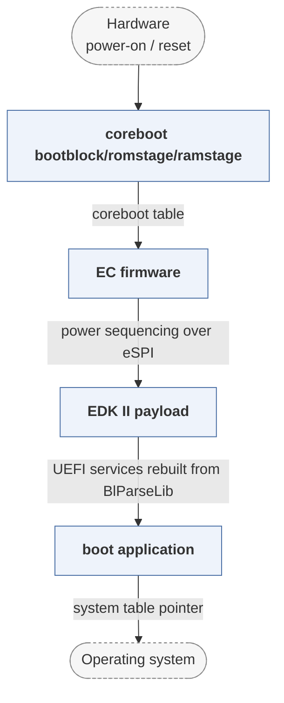

# firmware-open

*System76's open firmware distribution.*

| | |
|---|---|
| Type | **Firmware bootloader** (type1) |
| Upstream | https://github.com/system76/firmware-open |
| CVEs attributed | 0 |
| Vulnerability-fixing commits | 0 naming a CVE, 0 keyword-matched |
| CVEs with a linked fix | 0 |

## What it does at boot

coreboot plus EDK-II payload and System76 EC firmware for their laptops.

## Why it is Type 1

Type 1: vendor packaging of Type 1 firmware.

## How it boots

See [Boot-Stages](Boot-Stages) for the eight-stage model these phases map onto.



1. **coreboot bootblock/romstage/ramstage** -- Silicon and memory initialisation, using Intel FSP binaries for the parts that are not open.
2. **EC firmware** -- Separately built firmware for the embedded controller, handling power sequencing, keyboard and thermals alongside the main boot.
3. **EDK II payload** -- A UEFI payload runs as coreboot's payload, publishing UEFI services for the OS.
4. **boot application** -- The UEFI payload's BDS phase loads the distribution's bootloader from the EFI system partition.

### Passing data between stages

Two mechanisms meet here. coreboot hands the payload a coreboot table describing memory and the framebuffer; the EDK II payload reads that table through `BlParseLib` and rebuilds it as UEFI HOBs and system tables, so the OS sees a normal UEFI machine. The EC runs its own firmware and communicates with the host over the LPC/eSPI interface, out of band from the boot sequence.

### Handoff

The final handoff is UEFI's: the payload's BDS phase loads a boot application from the ESP and calls `ExitBootServices()`. System76's firmware update path also runs through this image, which is why the EC firmware is versioned with it.

## Security mechanisms

Detected in its build configuration and source:

- measured boot
- rollback protection
- secure boot

See [Security-Mechanisms](Security-Mechanisms) for how these are detected and what a detection does and does not prove.

## Analysing it

```bash
git -C oss-bootloaders submodule update --init type1/firmware-open
./scripts/analysis/run-tool.sh codeql firmware-open
```

See [Tools](Tools) for what each tool applies to.

---

[Home](Home) · [Firmware bootloader](Bootloader-Types) · [Tools](Tools)
