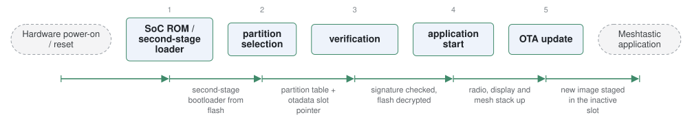

# firmware

*Meshtastic device firmware.*

| | |
|---|---|
| Type | **Monolithic bootloader** (type3) |
| Upstream | https://github.com/meshtastic/firmware |
| CVEs attributed | 0 |
| Vulnerability-fixing commits | 0 naming a CVE, 23 keyword-matched |
| CVEs with a linked fix | 0 |

## What it does at boot

ESP32 and nRF52 firmware for LoRa mesh radios, including its update path.

## Why it is Type 3

Type 3: device firmware that owns the MCU from reset.

## How it boots

See [Boot-Stages](Boot-Stages) for the eight-stage model these phases map onto.



1. **SoC ROM / second-stage loader** -- On ESP32 the mask ROM loads the second-stage bootloader from flash; on nRF52 an existing bootloader (Adafruit's or Nordic's) occupies that role.
2. **partition selection** -- The bootloader reads the partition table and the OTA data partition to decide which application slot to run.
3. **image verification** -- Where secure boot and flash encryption are enabled, the application image's signature is checked and its flash is decrypted.
4. **application start** -- The Meshtastic firmware starts: radio, display, GPS, and the mesh stack.
5. **OTA update** -- New images are received over the network or USB, written to the inactive slot, and marked for the next boot.

### Passing data between stages

The boot-time interface is the ESP-IDF one: a partition table in flash, an `otadata` partition holding the active-slot pointer and rollback state, and NVS for configuration the application persists. The application marks a new image valid after it has run successfully, and the bootloader reverts to the previous slot if that never happens -- the same confirm-or-rollback contract MCUboot uses, expressed in Espressif's format.

### Handoff

The bootloader jumps to the selected application image with nothing passed beyond what the partition table and otadata already determined. This entry is device firmware rather than a general bootloader, and it is in the corpus because its A/B update path and its network-facing update surface are the parts that matter for bootloader security.

## Security mechanisms

None detected. That means no matching pattern was found in its build configuration or source, not that the project is insecure -- a small MCU bootloader may simply have nothing to configure.

## Analysing it

```bash
git -C oss-bootloaders submodule update --init type3/firmware
./scripts/analysis/run-tool.sh codeql firmware
```

See [Tools](Tools) for what each tool applies to.

---

[Home](Home) · [Monolithic bootloader](Bootloader-Types) · [Tools](Tools)
