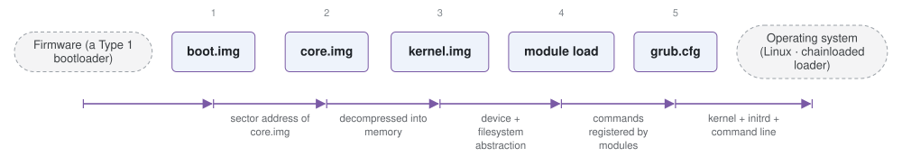

# grub

*GNU GRUB 2, the dominant Linux boot loader.*

| | |
|---|---|
| Type | **OS bootloader** (type2) |
| Upstream | https://git.savannah.gnu.org/git/grub |
| CVEs attributed | 93 |
| Vulnerability-fixing commits | 28 naming a CVE, 117 keyword-matched |
| CVEs with a linked fix | 27 |

## What it does at boot

Reads grub.cfg, offers a menu and a scripting shell, loads a kernel and initrd from a filesystem, and boots it or chainloads another loader.

## Why it is Type 2

Type 2: it starts from an already-initialised machine, is driven entirely by on-disk configuration, and its whole purpose is preparing an OS.

## How it boots

The SoK paper gives a full case study of this bootloader in section 3.5. See [Boot-Stages](Boot-Stages) for the eight-stage model these phases map onto.



1. **boot.img** -- 512 bytes in the MBR. Its only job is to read the first sector of core.img, whose location was written into it at install time.
2. **core.img** -- The working bootloader: kernel.img plus the handful of modules needed to reach /boot -- a disk driver, a partition map parser, a filesystem driver.
3. **kernel.img** -- GRUB's core services: memory management, the device and filesystem abstraction, environment variables, the rescue shell.
4. **module load** -- Modules (*.mod) are loaded on demand from /boot/grub for filesystems, compression, video, cryptography and boot protocols.
5. **grub.cfg** -- The menu and its entries are read and executed as a script, which selects a kernel and its arguments.

### Passing data between stages

GRUB's stage boundaries exist because of a size limit, not a privilege boundary: each stage is the smallest thing that can find the next one. Once kernel.img is running, configuration moves into text -- `grub.cfg`, plus the environment block at `/boot/grub/grubenv` for values that must survive a reboot, such as the saved default entry -- and, on Debian-derived systems, `recordfail`, which those distributions add rather than GRUB itself. Modules communicate through the command table they register into, which is why a menu entry can `insmod` a filesystem driver and then use it in the next line. On a UEFI machine the first two stages collapse: the firmware loads `grubx64.efi`, a single image with the modules already built in.

### Handoff

A menu entry ends in a boot protocol command. `linux` loads a kernel and `initrd` its initial ramdisk, then GRUB assembles the boot parameters -- `root=UUID=...`, console settings, everything on the kernel command line -- calls `ExitBootServices()` if it is running under UEFI, and enters the kernel. `multiboot` does the same for a Multiboot2 kernel, passing a structured information table. `chainloader` instead loads another bootloader, which is how GRUB reaches the Windows boot manager.

## Attack surfaces seen in its CVEs

| Surface | | CVEs |
|---|---|---:|
| `SAS2` | Persistent data source (software) | 33 |
| `SAS4` | Boot-time features (software) | 6 |
| `SAS1` | Remote access (software) | 6 |
| `HAS2` | External hardware (hardware) | 4 |
| `HAS1` | Invasive hardware (hardware) | 1 |

## Most common weaknesses

| CWE | CVEs |
|---|---:|
| CWE-787 | 21 |
| CWE-190 | 6 |
| CWE-122 | 4 |
| CWE-416 | 4 |
| CWE-825 | 4 |
| CWE-362 | 2 |
| CWE-276 | 2 |
| CWE-290 | 2 |

## Security mechanisms

Detected in its build configuration and source:

- aslr
- measured boot
- secure boot
- signature verification
- stack protector

See [Security-Mechanisms](Security-Mechanisms) for how these are detected and what a detection does and does not prove.

## Reproducible vulnerabilities

Each of these resolves to a fixing commit and to the parent revision that still contains the bug:

| CVE | Fix | Vulnerable revision |
|---|---|---|
| CVE-2015-8370 | `451d80e52d` | `ff5726b878` |
| CVE-2020-10713 | `a4d3fbdff1` | `6a34fdb76a` |
| CVE-2020-14308 | `f725fa7cb2` | `64e26162eb` |
| CVE-2020-14309 | `3f05d693d1` | `f725fa7cb2` |
| CVE-2020-14310 | `3f05d693d1` | `f725fa7cb2` |
| CVE-2020-14311 | `3f05d693d1` | `f725fa7cb2` |
| CVE-2020-15705 | `968de8c23c` | `bb51ee2b49` |
| CVE-2020-15706 | `426f57383d` | `1a8d9c9b4a` |
| CVE-2020-15707 | `e7b8856f8b` | `0dcbf3652b` |
| CVE-2020-25632 | `7630ec5397` | `f05e79a014` |
| CVE-2020-25647 | `128c16a682` | `7630ec5397` |
| CVE-2020-27749 | `4ea7bae51f` | `030fb6c4fa` |
| CVE-2020-27779 | `d298b41f90` | `3e8e4c0549` |
| CVE-2021-20225 | `2a330dba93` | `fe0586347e` |
| CVE-2021-20233 | `2f533a89a8` | `0a05f88e2b` |
| … and 12 more | | |

```bash
git -C oss-bootloaders/type2/grub checkout <vulnerable revision>
```

## Analysing it

```bash
git -C oss-bootloaders submodule update --init type2/grub
./scripts/analysis/run-tool.sh codeql grub
```

See [Tools](Tools) for what each tool applies to.

---

[Home](Home) · [OS bootloader](Bootloader-Types) · [Tools](Tools)
