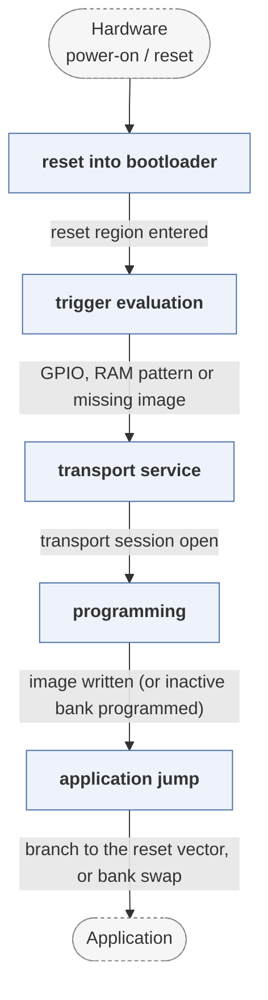

# harmony

*Microchip Harmony bootloader framework.*

| | |
|---|---|
| Type | **Monolithic bootloader** (type3) |
| Upstream | https://github.com/Microchip-MPLAB-Harmony/bootloader |
| CVEs attributed | 0 |
| Vulnerability-fixing commits | 0 naming a CVE, 0 keyword-matched |
| CVEs with a linked fix | 0 |

## What it does at boot

Configurable bootloader for PIC and SAM devices with several update transports.

## Why it is Type 3

Type 3: reset to application.

## How it boots

See [Boot-Stages](Boot-Stages) for the eight-stage model these phases map onto.



1. **reset into bootloader** -- The Harmony bootloader occupies the reset region of the PIC32 or SAM device.
2. **trigger evaluation** -- A configurable trigger -- GPIO, a RAM pattern written by the application, or a missing valid application -- decides whether to enter update mode.
3. **transport service** -- Serves the selected transport: UART, USB (device or host), CAN, Ethernet/UDP or SD card.
4. **programming** -- Receives the image, optionally verifies a CRC or signature, and writes it to the application region -- with a dual-bank variant that programs the inactive bank.
5. **application jump** -- Transfers control to the application's reset address.

### Passing data between stages

Harmony's bootloader is generated rather than hand-written: MPLAB Harmony Configurator emits the bootloader for the chosen device and transports, so the stage structure is fixed and the variation is in configuration. The application signals a wish to re-enter the bootloader through a trigger pattern in a RAM region both sides agree on, checked before RAM is initialised.

### Handoff

The jump is a branch to the application's reset vector with nothing passed. In the dual-bank configuration the handoff is instead a bank swap at reset, which makes the update atomic and the fallback automatic.

## Security mechanisms

None detected. That means no matching pattern was found in its build configuration or source, not that the project is insecure -- a small MCU bootloader may simply have nothing to configure.

## Analysing it

```bash
git -C oss-bootloaders submodule update --init type3/harmony
./scripts/analysis/run-tool.sh codeql harmony
```

See [Tools](Tools) for what each tool applies to.

---

[Home](Home) · [Monolithic bootloader](Bootloader-Types) · [Tools](Tools)
