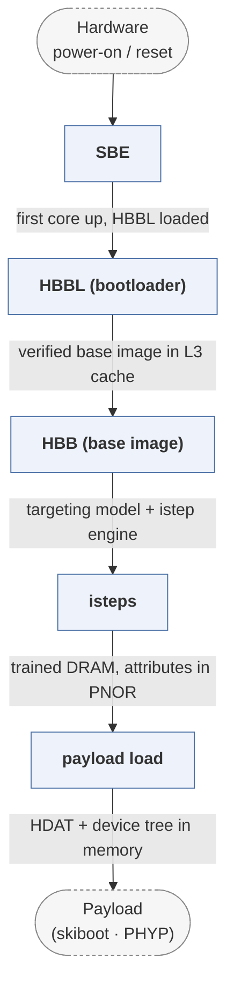

# hostboot

*IBM OpenPOWER host firmware.*

| | |
|---|---|
| Type | **Firmware bootloader** (type1) |
| Upstream | https://github.com/open-power/hostboot |
| CVEs attributed | 0 |
| Vulnerability-fixing commits | 0 naming a CVE, 88 keyword-matched |
| CVEs with a linked fix | 0 |

## What it does at boot

Initialises POWER processors and memory from the service processor handoff, then loads skiboot.

## Why it is Type 1

Type 1: bare-hardware bring-up that hands off to a separate OS-facing stage.

## How it boots

See [Boot-Stages](Boot-Stages) for the eight-stage model these phases map onto.



1. **SBE** -- The Self-Boot Engine, running on the processor's on-chip controller, initialises the first core and loads the Hostboot base image.
2. **HBBL (bootloader)** -- A small loader that verifies the base image and unpacks it into L3 cache configured as memory, because DRAM does not exist yet.
3. **HBB (base image)** -- Sets up the kernel, tasks and the targeting model that describes every piece of hardware in the system.
4. **isteps** -- A long sequence of numbered initialisation steps -- clocks, buses, memory training, PCIe -- each one a discrete, restartable unit.
5. **payload load** -- Builds the hardware description and loads the payload (skiboot or PHYP) into DRAM.

### Passing data between stages

Hostboot's stages share a targeting model: an attribute database of hardware targets, persisted to PNOR, which every istep reads and updates. Because the isteps are numbered and their state is externalised, a failed boot can be resumed or a deconfiguration recorded and carried forward. Communication with the service processor runs over a mailbox, and the result of the whole sequence is serialised into HDAT, the structured hardware description the payload consumes.

### Handoff

Hostboot places HDAT structures and the device tree in memory, then jumps to the payload it loaded -- skiboot on OpenPOWER, PHYP on PowerVM. It does not disappear: Hostboot runtime services stay resident to handle attribute access and error logging for the payload and the OS.

## Security mechanisms

Detected in its build configuration and source:

- fortify
- measured boot
- rollback protection
- secure boot

See [Security-Mechanisms](Security-Mechanisms) for how these are detected and what a detection does and does not prove.

## Analysing it

```bash
git -C oss-bootloaders submodule update --init type1/hostboot
./scripts/analysis/run-tool.sh codeql hostboot
```

See [Tools](Tools) for what each tool applies to.

---

[Home](Home) · [Firmware bootloader](Bootloader-Types) · [Tools](Tools)
