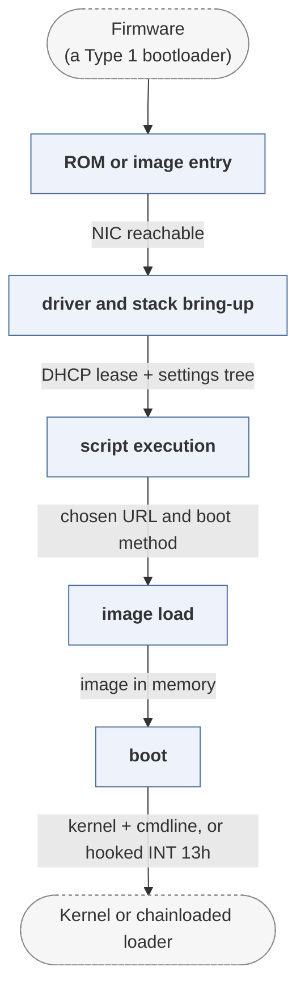

# ipxe

*Open-source network boot firmware.*

| | |
|---|---|
| Type | **OS bootloader** (type2) |
| Upstream | https://github.com/ipxe/ipxe |
| CVEs attributed | 3 |
| Vulnerability-fixing commits | 0 naming a CVE, 54 keyword-matched |
| CVEs with a linked fix | 0 |

## What it does at boot

Provides PXE and its own scripting, fetching kernels over HTTP, iSCSI or Infiniband and booting them.

## Why it is Type 2

Type 2: it runs as an option ROM or UEFI application on an initialised machine and loads an OS over the network.

## How it boots

See [Boot-Stages](Boot-Stages) for the eight-stage model these phases map onto.



1. **ROM or image entry** -- Runs as a PCI option ROM, a UEFI driver, or an image chainloaded by another bootloader.
2. **driver and stack bring-up** -- Initialises the network card, then its own TCP/IP stack, DHCP client and TLS.
3. **script execution** -- Runs an embedded or downloaded iPXE script, which decides what to boot.
4. **image load** -- Fetches the target over HTTP, HTTPS, iSCSI, FCoE, AoE or NFS and loads it into memory.
5. **boot** -- Starts the loaded image, or exposes a remote volume as a local disk and boots from that instead.

### Passing data between stages

iPXE replaces PXE's TFTP-only path with a full network stack, and its state is the DHCP option space plus its own settings tree: values such as `${net0/mac}`, `${filename}` and custom options are readable in scripts and substituted into URLs. Scripts are fetched over the network, so the boot decision can be made by a server per machine. Because it can present an iSCSI or AoE target as an INT 0x13 drive (or a UEFI block device), an OS installer that knows nothing about the network can install onto a remote volume.

### Handoff

How control transfers depends on the target: a Linux kernel is started with its command line and initrd, another bootloader is chainloaded, or -- in the SAN case -- iPXE stays resident, hooks the disk interface, and hands off to a boot sector that reads what is actually a remote block device. That last mode means iPXE is still executing while the OS believes it is talking to local storage.

## Most common weaknesses

| CWE | CVEs |
|---|---:|
| CWE-284 | 1 |
| CWE-347 | 1 |
| CWE-669 | 1 |

## Security mechanisms

Detected in its build configuration and source:

- cfi
- encryption
- measured boot
- secure boot
- signature verification
- stack protector

See [Security-Mechanisms](Security-Mechanisms) for how these are detected and what a detection does and does not prove.

## Analysing it

```bash
git -C oss-bootloaders submodule update --init type2/ipxe
./scripts/analysis/run-tool.sh codeql ipxe
```

See [Tools](Tools) for what each tool applies to.

---

[Home](Home) · [OS bootloader](Bootloader-Types) · [Tools](Tools)
