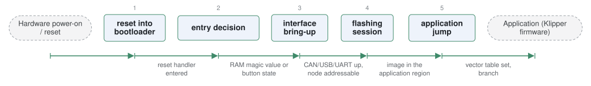

# katapult

*CAN, USB and UART bootloader for MCUs, common on 3D printer boards.*

| | |
|---|---|
| Type | **Monolithic bootloader** (type3) |
| Upstream | https://github.com/Arksine/katapult |
| CVEs attributed | 0 |
| Vulnerability-fixing commits | 0 naming a CVE, 2 keyword-matched |
| CVEs with a linked fix | 0 |

## What it does at boot

Accepts firmware over its supported transports, then runs the application.

## Why it is Type 3

Type 3: reset to application.

## How it boots

See [Boot-Stages](Boot-Stages) for the eight-stage model these phases map onto.



1. **reset into bootloader** -- Katapult occupies the start of flash and runs first on every reset.
2. **entry decision** -- Stays in the bootloader if a request flag was left in a known RAM location, a button is held, or no valid application is present.
3. **interface bring-up** -- Brings up CAN, USB or UART using Klipper's hardware abstraction layer, stripped down.
4. **flashing session** -- Receives the application image in blocks and writes it to the application region.
5. **application jump** -- Verifies the image checksum, then jumps to the application.

### Passing data between stages

Katapult shares Klipper's HAL, so the bootloader and the application it loads are built from the same driver code -- unusual, and the reason its footprint is small. On CAN it uses the same node-identification scheme as Klipper, so a toolhead board can be addressed by UUID on a shared bus. The request to stay in the bootloader is passed from the application through a magic value in RAM that survives a soft reset.

### Handoff

The jump is the standard Cortex-M vector-table relocation and branch, with nothing passed. Because flashing happens over a shared CAN bus, the relevant exposure is that any node able to speak on that bus can address the bootloader.

## Security mechanisms

Detected in its build configuration and source:

- rollback protection
- secure boot

See [Security-Mechanisms](Security-Mechanisms) for how these are detected and what a detection does and does not prove.

## Analysing it

```bash
git -C oss-bootloaders submodule update --init type3/katapult
./scripts/analysis/run-tool.sh codeql katapult
```

See [Tools](Tools) for what each tool applies to.

---

[Home](Home) · [Monolithic bootloader](Bootloader-Types) · [Tools](Tools)
