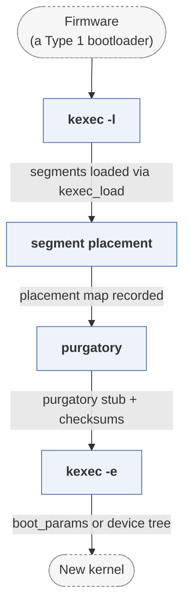

# kexec-tools

*Userspace tooling to boot a new kernel from a running one.*

| | |
|---|---|
| Type | **OS bootloader** (type2) |
| Upstream | https://github.com/horms/kexec-tools |
| CVEs attributed | 0 |
| Vulnerability-fixing commits | 0 naming a CVE, 12 keyword-matched |
| CVEs with a linked fix | 0 |

## What it does at boot

Loads a kernel image into memory and transfers control without firmware re- init.

## Why it is Type 2

Type 2: an OS-loading stage that assumes a fully initialised machine.

## How it boots

See [Boot-Stages](Boot-Stages) for the eight-stage model these phases map onto.



1. **kexec -l** -- Loads a kernel, initrd and command line into the running kernel's memory through the kexec_load syscall.
2. **segment placement** -- The kernel decides where the segments live, avoiding memory in use, and records them for the reboot path.
3. **purgatory** -- A small position-independent stub is placed between the two kernels; it verifies segment checksums after the old kernel has stopped.
4. **kexec -e** -- Devices are shut down, the CPU is put in a known state, and control jumps to purgatory and then the new kernel.

### Passing data between stages

The whole point is to skip firmware, so nothing is re-discovered: the new kernel is given its boot parameters and device tree or boot_params structure directly by the old one, built in userspace by kexec-tools from `/proc/iomem`, `/sys/firmware/fdt` and the existing command line. The only code that runs between the two kernels is purgatory, which is deliberately tiny because at that point there is no kernel to fall back on. `kexec -p` reserves a separate region at boot for a crash kernel, so a dump kernel can start from a machine that has already failed.

### Handoff

Control passes to the new kernel's normal entry point in the state the architecture's boot protocol specifies -- for x86 a filled-in `boot_params`, for ARM and Power a device tree pointer. Firmware is never re-entered, which is both the speed advantage and the limitation: hardware left in a bad state by the old kernel is not reset.

## Security mechanisms

None detected. That means no matching pattern was found in its build configuration or source, not that the project is insecure -- a small MCU bootloader may simply have nothing to configure.

## Analysing it

```bash
git -C oss-bootloaders submodule update --init type2/kexec-tools
./scripts/analysis/run-tool.sh codeql kexec-tools
```

See [Tools](Tools) for what each tool applies to.

---

[Home](Home) · [OS bootloader](Bootloader-Types) · [Tools](Tools)
