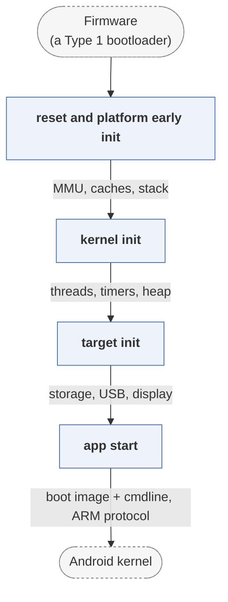

# lk

*Little Kernel, a small embedded OS used as a bootloader.*

| | |
|---|---|
| Type | **OS bootloader** (type2) |
| Upstream | https://github.com/littlekernel/lk |
| CVEs attributed | 6 |
| Vulnerability-fixing commits | 1 naming a CVE, 12 keyword-matched |
| CVEs with a linked fix | 0 |

## What it does at boot

Used by Qualcomm as the Android aboot bootloader: initialises minimal hardware, verifies and boots the Android boot image.

## Why it is Type 2

Type 2 in this corpus: it runs after the SoC's primary bootloader has brought the platform up, and loads an OS. Arguably Type 3 on platforms where it is the only stage.

## How it boots

See [Boot-Stages](Boot-Stages) for the eight-stage model these phases map onto.



1. **reset and platform early init** -- Architecture entry code sets up the MMU, caches and stack, then calls platform early init.
2. **kernel init** -- Brings up the threading kernel, timers and heap -- LK is a small preemptive kernel, not just a loader.
3. **target init** -- Board-specific initialisation: display, storage, USB.
4. **app start** -- Starts the built-in application, which on a phone is the aboot bootloader app.

### Passing data between stages

LK is a kernel first and a bootloader second, so its stages are module init levels rather than separate binaries: drivers register init hooks at a declared level and the kernel calls them in order, all within one image. As a bootloader its external interface is Fastboot over USB -- flashing, `boot`, `oem` commands -- and the shared memory and SMEM structures the Qualcomm firmware left behind, which tell it the board identity and why the device reset.

### Handoff

The aboot application parses an Android boot image -- kernel, ramdisk and a device tree appended or selected from a dtbo partition -- verifies it if verified boot is enabled, assembles the kernel command line with the boot mode and serial number, and jumps to the kernel with the ARM boot protocol. On modern Qualcomm devices this role has moved into ABL under UEFI, so LK is mainly seen on older hardware.

## Attack surfaces seen in its CVEs

| Surface | | CVEs |
|---|---|---:|
| `SAS4` | Boot-time features (software) | 1 |

## Most common weaknesses

| CWE | CVEs |
|---|---:|
| CWE-703 | 1 |
| CWE-20 | 1 |

## Security mechanisms

Detected in its build configuration and source:

- encryption
- rollback protection
- signature verification

See [Security-Mechanisms](Security-Mechanisms) for how these are detected and what a detection does and does not prove.

## Analysing it

```bash
git -C oss-bootloaders submodule update --init type2/lk
./scripts/analysis/run-tool.sh codeql lk
```

See [Tools](Tools) for what each tool applies to.

---

[Home](Home) · [OS bootloader](Bootloader-Types) · [Tools](Tools)
