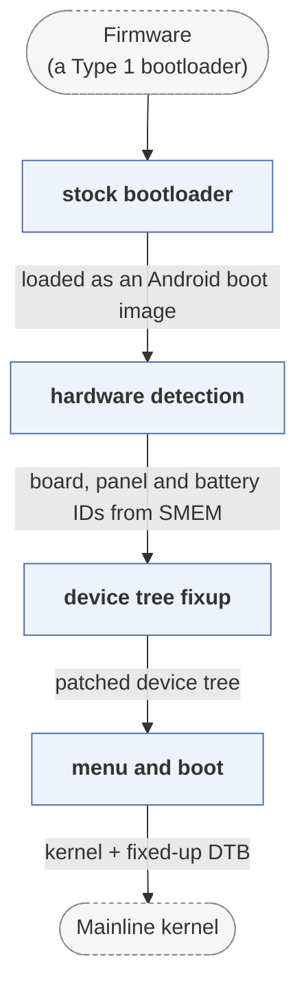

# lk2nd

*Second-stage LK bootloader for msm8916 mainline Linux.*

| | |
|---|---|
| Type | **OS bootloader** (type2) |
| Upstream | https://github.com/msm8916-mainline/lk2nd |
| CVEs attributed | 0 |
| Vulnerability-fixing commits | 4 naming a CVE, 92 keyword-matched |
| CVEs with a linked fix | 0 |

## What it does at boot

Loads from the stock aboot and boots mainline Linux with a proper device tree.

## Why it is Type 2

Type 2: explicitly a second stage that prepares an OS.

## How it boots

See [Boot-Stages](Boot-Stages) for the eight-stage model these phases map onto.



1. **stock bootloader** -- The device's own LK or ABL loads lk2nd as if it were an Android boot image.
2. **hardware detection** -- Identifies the board, display panel and battery from the SMEM and device tree information the firmware left.
3. **device tree fixup** -- Patches or selects a device tree matching what it detected.
4. **menu and boot** -- Offers Fastboot and a menu, then boots a kernel from a partition, a filesystem or an SD card.

### Passing data between stages

lk2nd is a second-stage bootloader: it is installed where the vendor expects a kernel, so its input is the Android boot image format, and its job is to undo the vendor's assumptions before the real kernel sees them. The important state is what the proprietary firmware left in SMEM -- board ID, panel ID, charger status -- which lk2nd reads and translates into a device tree and command line a mainline kernel can use.

### Handoff

It boots a kernel with the standard ARM protocol, passing the fixed-up device tree it assembled. Because it re-implements Fastboot, it also gives devices with a hostile or crippled vendor bootloader a consistent flashing interface, which is the practical reason postmarketOS uses it.

## Security mechanisms

Detected in its build configuration and source:

- encryption
- rollback protection
- secure boot
- signature verification

See [Security-Mechanisms](Security-Mechanisms) for how these are detected and what a detection does and does not prove.

## Analysing it

```bash
git -C oss-bootloaders submodule update --init type2/lk2nd
./scripts/analysis/run-tool.sh codeql lk2nd
```

See [Tools](Tools) for what each tool applies to.

---

[Home](Home) · [OS bootloader](Bootloader-Types) · [Tools](Tools)
