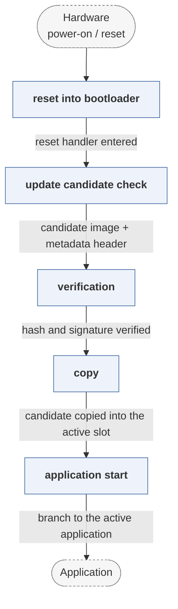

# mbed-bootloader

*Mbed OS bootloader with firmware update support.*

| | |
|---|---|
| Type | **Monolithic bootloader** (type3) |
| Upstream | https://github.com/PelionIoT/mbed-bootloader |
| CVEs attributed | 0 |
| Vulnerability-fixing commits | 0 naming a CVE, 0 keyword-matched |
| CVEs with a linked fix | 0 |

## What it does at boot

Verifies and applies an update image, then boots the Mbed application.

## Why it is Type 3

Type 3: reset to application.

## How it boots

See [Boot-Stages](Boot-Stages) for the eight-stage model these phases map onto.



1. **reset into bootloader** -- Runs first from the start of flash.
2. **update candidate check** -- Looks for a firmware candidate in internal or external storage, placed there by Pelion Device Management Client.
3. **verification** -- Checks the candidate's hash and signature against the manifest the update client validated.
4. **copy** -- Copies the candidate into the active application region, tracking progress so an interrupted copy resumes.
5. **application start** -- Jumps to the active application.

### Passing data between stages

The bootloader and the update client communicate through a firmware metadata header written alongside each image -- version, size, hash and signature -- kept in a known location so the bootloader can make its decision without the client running. The active and candidate headers are duplicated so a power loss during the header write cannot leave an ambiguous state.

### Handoff

The jump to the application passes nothing. Its role in the corpus is as the device-side half of a managed OTA pipeline: the interesting security properties are in the manifest format and the key provisioning, not in the boot flow itself.

## Security mechanisms

Detected in its build configuration and source:

- rollback protection

See [Security-Mechanisms](Security-Mechanisms) for how these are detected and what a detection does and does not prove.

## Analysing it

```bash
git -C oss-bootloaders submodule update --init type3/mbed-bootloader
./scripts/analysis/run-tool.sh codeql mbed-bootloader
```

See [Tools](Tools) for what each tool applies to.

---

[Home](Home) · [Monolithic bootloader](Bootloader-Types) · [Tools](Tools)
