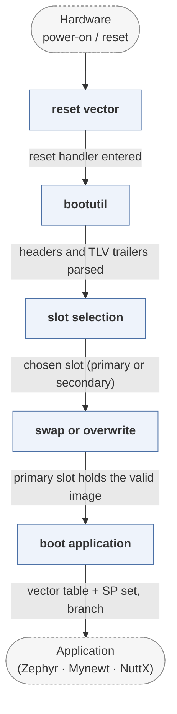

# mcuboot

*Secure bootloader for 32-bit microcontrollers.*

| | |
|---|---|
| Type | **Monolithic bootloader** (type3) |
| Upstream | https://github.com/mcu-tools/mcuboot |
| CVEs attributed | 3 |
| Vulnerability-fixing commits | 9 naming a CVE, 10 keyword-matched |
| CVEs with a linked fix | 0 |

## What it does at boot

Validates image signatures, manages primary/secondary slots, handles rollback and swap, then jumps to the application.

## Why it is Type 3

Type 3: it runs from reset on the MCU and jumps straight into the application -- there is no OS-loader stage to hand off to.

## How it boots

The SoK paper gives a full case study of this bootloader in section 3.6. See [Boot-Stages](Boot-Stages) for the eight-stage model these phases map onto.



1. **reset vector** -- The MCU resets into MCUboot, which occupies the first region of flash.
2. **bootutil** -- The core library: reads the image headers and TLV trailers, validates signatures and hashes, and implements the swap logic.
3. **slot selection** -- Decides between the primary and secondary slot based on the image trailer's flags -- a pending update, a test image awaiting confirmation, or a revert.
4. **swap or overwrite** -- If an update is pending, the slots are swapped through the scratch area, or the secondary simply overwrites the primary.
5. **boot application** -- Board- and RTOS-specific code sets the vector table and stack pointer and jumps to the primary slot's entry point.

### Passing data between stages

MCUboot's stage communication is flash layout. The image trailer at the end of each slot holds the magic value, the image-OK and copy-done flags and the swap status -- written in a defined order so an interrupted swap can be resumed rather than bricking the device. That trailer is the only channel between the running application and the bootloader: the application confirms a new image by writing image-OK, and a reset without that confirmation causes a revert. There are no system tables and no runtime services; everything else is fixed at build time.

### Handoff

The jump to the application is deliberately minimal -- vector table relocated, stack pointer set, branch to the reset handler -- and nothing is passed. The application can read boot metadata back through `boot_serial` or the shared data region if the platform enables it, which is also how measured-boot data reaches a TF-M secure image.

## Most common weaknesses

| CWE | CVEs |
|---|---:|
| CWE-354 | 1 |
| CWE-121 | 1 |
| CWE-347 | 1 |

## Security mechanisms

Detected in its build configuration and source:

- cfi
- encryption
- measured boot
- rollback protection
- secure boot
- signature verification

See [Security-Mechanisms](Security-Mechanisms) for how these are detected and what a detection does and does not prove.

## Analysing it

```bash
git -C oss-bootloaders submodule update --init type3/mcuboot
./scripts/analysis/run-tool.sh codeql mcuboot
```

See [Tools](Tools) for what each tool applies to.

---

[Home](Home) · [Monolithic bootloader](Bootloader-Types) · [Tools](Tools)
