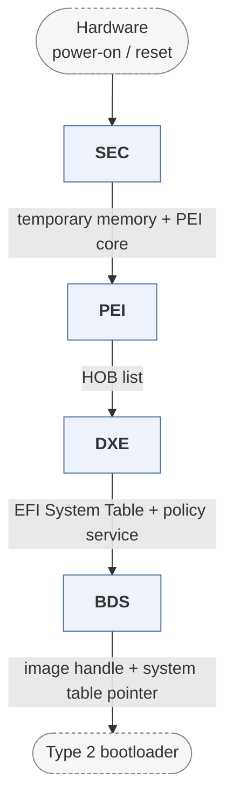

# mu_basecore

*Microsoft's Project Mu fork of EDK-II.*

| | |
|---|---|
| Type | **Firmware bootloader** (type1) |
| Upstream | https://github.com/microsoft/mu_basecore |
| CVEs attributed | 0 |
| Vulnerability-fixing commits | 94 naming a CVE, 383 keyword-matched |
| CVEs with a linked fix | 29 |

## What it does at boot

Supplies the core UEFI packages that Mu platform repositories build against; ships on Surface devices and Hyper-V.

## Why it is Type 1

Type 1: a UEFI implementation. Note it is a library repository, not a standalone buildable platform.

## How it boots

See [Boot-Stages](Boot-Stages) for the eight-stage model these phases map onto.



1. **SEC** -- As in EDK II: reset-vector code, temporary memory, root of trust.
2. **PEI** -- Permanent memory bring-up through PEIMs, results recorded as HOBs.
3. **DXE** -- Driver dispatch, device enumeration, Boot and Runtime Services.
4. **BDS** -- Boot device selection from NVRAM variables.

### Passing data between stages

Project Mu is a fork of EDK II, so the communication mechanisms are EDK II's: HOB list from PEI to DXE, the EFI System Table and protocol database from DXE onward, and NVRAM variables for persistent configuration. What Mu adds is policy and structure around them -- a policy service for cross-module settings, and package boundaries maintained so platforms consume Mu as a versioned dependency instead of forking the tree.

### Handoff

Identical to EDK II: BDS loads a boot application from the EFI system partition with a pointer to the system table, and `ExitBootServices()` marks the transition to the OS. In practice mu_basecore is not built alone -- a platform repository supplies the silicon and board packages that complete the image.

## Security mechanisms

Detected in its build configuration and source:

- cfi
- measured boot
- rollback protection
- secure boot
- signature verification

See [Security-Mechanisms](Security-Mechanisms) for how these are detected and what a detection does and does not prove.

## Reproducible vulnerabilities

Each of these resolves to a fixing commit and to the parent revision that still contains the bug:

| CVE | Fix | Vulnerable revision |
|---|---|---|
| CVE-2018-12182 | `cf574f0a18` | `83f997e58d` |
| CVE-2019-14558 | `f1d78c489a` | `764e8ba138` |
| CVE-2019-14558 | `764e8ba138` | `c32be82e99` |
| CVE-2019-14584 | `26442d11e6` | `f82b827c92` |
| CVE-2022-36765 | `9a75b030cf` | `aeaee8944f` |
| CVE-2022-36765 | `aeaee8944f` | `049695a0b1` |
| CVE-2022-36765 | `59f024c76e` | `9971b99461` |
| CVE-2023-45229 | `5fd3078a2e` | `75deaf5c3c` |
| CVE-2023-45229 | `1c440a5ece` | `a1c426e844` |
| CVE-2023-45229 | `07362769ab` | `1dbb10cc52` |
| CVE-2023-45229 | `1dbb10cc52` | `5f3658197b` |
| CVE-2023-45230 | `5f3658197b` | `8014ac2d7b` |
| CVE-2023-45230 | `f31453e8d6` | `959f71c801` |
| CVE-2023-45231 | `6f77463d72` | `bbfee34f41` |
| CVE-2023-45231 | `bbfee34f41` | `07362769ab` |
| … and 14 more | | |

```bash
git -C oss-bootloaders/type1/mu_basecore checkout <vulnerable revision>
```

## Analysing it

```bash
git -C oss-bootloaders submodule update --init type1/mu_basecore
./scripts/analysis/run-tool.sh codeql mu_basecore
```

See [Tools](Tools) for what each tool applies to.

---

[Home](Home) · [Firmware bootloader](Bootloader-Types) · [Tools](Tools)
