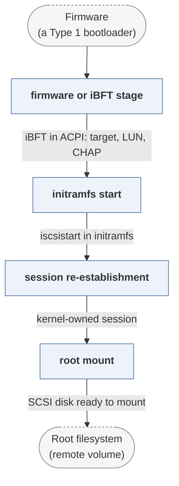

# open-iscsi

*Linux iSCSI initiator, used for network root and boot.*

| | |
|---|---|
| Type | **OS bootloader** (type2) |
| Upstream | https://github.com/open-iscsi/open-iscsi |
| CVEs attributed | 0 |
| Vulnerability-fixing commits | 6 naming a CVE, 32 keyword-matched |
| CVEs with a linked fix | 0 |

## What it does at boot

Establishes iSCSI sessions so a remote volume can serve as the boot disk.

## Why it is Type 2

Type 2 by association: it is boot-path infrastructure for network boot rather than a bootloader that transfers control to a kernel. The weakest fit in the corpus.

## How it boots

See [Boot-Stages](Boot-Stages) for the eight-stage model these phases map onto.



1. **firmware or iBFT stage** -- A network card's option ROM or the firmware establishes the initial iSCSI session and records the parameters in the iSCSI Boot Firmware Table.
2. **initramfs start** -- Linux boots far enough to run an initramfs containing iscsistart.
3. **session re-establishment** -- The iBFT parameters are read from /sys/firmware/ibft and the session is re- created by the in-kernel initiator.
4. **root mount** -- The remote volume appears as a SCSI disk and the root filesystem is mounted from it.

### Passing data between stages

open-iscsi is boot-path infrastructure rather than a bootloader, and the handoff it participates in is a state transfer: the firmware-owned session must be replaced by a kernel-owned one without the block device disappearing underneath the mount. iBFT is the structure that makes that possible -- the firmware publishes target address, LUN, initiator name and CHAP credentials in an ACPI table, and the initramfs reads them back out.

### Handoff

There is no transfer of control to a next stage. It is included because the corpus tracks the boot path as an attack surface, and a root filesystem reached over the network -- with credentials sitting in an ACPI table -- is part of that path.

## Security mechanisms

None detected. That means no matching pattern was found in its build configuration or source, not that the project is insecure -- a small MCU bootloader may simply have nothing to configure.

## Analysing it

```bash
git -C oss-bootloaders submodule update --init type2/open-iscsi
./scripts/analysis/run-tool.sh codeql open-iscsi
```

See [Tools](Tools) for what each tool applies to.

---

[Home](Home) · [OS bootloader](Bootloader-Types) · [Tools](Tools)
