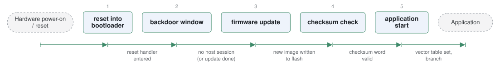

# openblt

*Open-source bootloader for automotive and embedded MCUs.*

| | |
|---|---|
| Type | **Monolithic bootloader** (type3) |
| Upstream | https://github.com/feaser/openblt |
| CVEs attributed | 0 |
| Vulnerability-fixing commits | 0 naming a CVE, 0 keyword-matched |
| CVEs with a linked fix | 0 |

## What it does at boot

Provides firmware update over CAN, USB, UART or TCP/IP, then runs the application.

## Why it is Type 3

Type 3: reset to application with an update path.

## How it boots

See [Boot-Stages](Boot-Stages) for the eight-stage model these phases map onto.



1. **reset into bootloader** -- OpenBLT occupies the first part of flash and runs at every reset.
2. **backdoor window** -- For a short, configurable period it listens on the enabled transports -- RS232, CAN, USB, TCP/IP, Modbus RTU -- for a host tool requesting an update.
3. **firmware update** -- If a session is opened, XCP commands from MicroBoot or BootCommander erase and program the application area; an SD card update path does the same from a file.
4. **checksum check** -- The application's signature/checksum word is verified.
5. **application start** -- Vector table and stack pointer are set from the application and control jumps to it.

### Passing data between stages

The protocol between host and target is XCP over whichever transport is configured, so the same PC tooling works across every supported MCU family. On the target side the state is small and explicit: a checksum word the bootloader writes and verifies, and a shared RAM location the application can set before resetting to request that the backdoor stay open -- the standard way an application triggers its own update.

### Handoff

Nothing is passed to the application beyond the hardware state; the bootloader remaps the vector table and branches. Because the backdoor window runs before verification and listens on external interfaces, it is the part of the design most relevant to the external-hardware and remote-access attack surfaces.

## Security mechanisms

Detected in its build configuration and source:

- encryption
- secure boot

See [Security-Mechanisms](Security-Mechanisms) for how these are detected and what a detection does and does not prove.

## Analysing it

```bash
git -C oss-bootloaders submodule update --init type3/openblt
./scripts/analysis/run-tool.sh codeql openblt
```

See [Tools](Tools) for what each tool applies to.

---

[Home](Home) · [Monolithic bootloader](Bootloader-Types) · [Tools](Tools)
