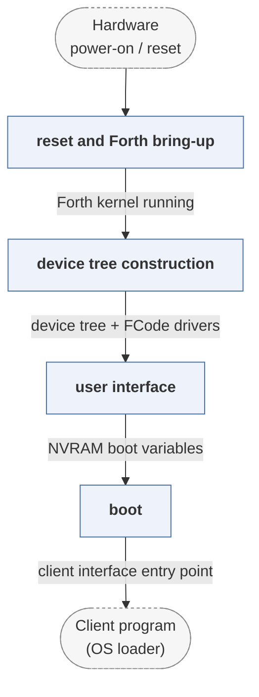

# openfirmware

*Mitch Bradley's original IEEE 1275 Open Firmware.*

| | |
|---|---|
| Type | **Firmware bootloader** (type1) |
| Upstream | https://github.com/MitchBradley/openfirmware |
| CVEs attributed | 0 |
| Vulnerability-fixing commits | 0 naming a CVE, 7 keyword-matched |
| CVEs with a linked fix | 0 |

## What it does at boot

Forth-based firmware providing device discovery, a device tree and a client interface for the OS loader.

## Why it is Type 1

Type 1: the canonical hardware-agnostic firmware interface.

## How it boots

See [Boot-Stages](Boot-Stages) for the eight-stage model these phases map onto.



1. **reset and Forth bring-up** -- Processor-specific reset code initialises memory and starts the Forth kernel.
2. **device tree construction** -- Probing creates the device tree; FCode drivers in expansion ROMs are interpreted and add their own nodes.
3. **user interface** -- The `ok` prompt is available, allowing the tree to be inspected and boot variables changed.
4. **boot** -- `boot` loads the client program named by `boot-device` and transfers to it through the client interface.

### Passing data between stages

This is the implementation the IEEE 1275 standard was written from, and the mechanisms are the standard's: a device tree of nodes with properties and methods, NVRAM configuration variables, and FCode -- tokenised Forth carried in a card's ROM -- so a plug-in device can describe and drive itself to firmware that has never seen it. Because the interpreter is present throughout, the boundary between stages is a vocabulary boundary rather than a binary one.

### Handoff

The client program is entered with the client-interface entry point in a register defined per architecture. It calls back for device access and memory claims until it has loaded the kernel, at which point it stops calling and the firmware's resources may be reclaimed. On SPARC and PowerPC this same interface is what the OS kernel reads its device tree from.

## Security mechanisms

None detected. That means no matching pattern was found in its build configuration or source, not that the project is insecure -- a small MCU bootloader may simply have nothing to configure.

## Analysing it

```bash
git -C oss-bootloaders submodule update --init type1/openfirmware
./scripts/analysis/run-tool.sh codeql openfirmware
```

See [Tools](Tools) for what each tool applies to.

---

[Home](Home) · [Firmware bootloader](Bootloader-Types) · [Tools](Tools)
