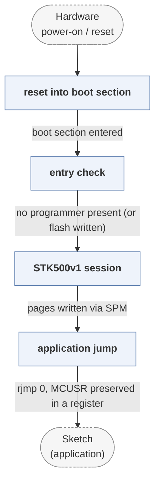

# optiboot

*The small AVR bootloader shipped on most Arduino boards.*

| | |
|---|---|
| Type | **Monolithic bootloader** (type3) |
| Upstream | https://github.com/Optiboot/optiboot |
| CVEs attributed | 0 |
| Vulnerability-fixing commits | 0 naming a CVE, 0 keyword-matched |
| CVEs with a linked fix | 0 |

## What it does at boot

Occupies the boot section, accepts an STK500 upload over serial, then jumps to the sketch.

## Why it is Type 3

Type 3: reset to application on an 8-bit MCU.

## How it boots

See [Boot-Stages](Boot-Stages) for the eight-stage model these phases map onto.



1. **reset into boot section** -- AVR fuses set the reset vector into the 512-byte boot section where Optiboot lives.
2. **entry check** -- Decides whether to enter programming mode: a reset cause check, and a short window waiting for STK500 activity on the UART.
3. **STK500v1 session** -- If a programmer is talking, receives pages over the serial line and writes them to flash with SPM.
4. **application jump** -- Times out or finishes, then jumps to address 0 to start the sketch.

### Passing data between stages

Optiboot is 512 bytes, which dictates everything: the protocol is a minimal subset of STK500v1 over the UART, there is no configuration storage, and the only state passed to the application is the MCU status register value, which Optiboot preserves in a register so the sketch can tell a power-on reset from a watchdog reset. The `fastboot` behaviour -- starting the application immediately unless a reset came from the right source -- exists to avoid the delay a larger bootloader would impose.

### Handoff

The jump to the application is a bare `rjmp` to address 0. Nothing is verified: Optiboot has no signature checking, which is appropriate for its size and its role but makes physical access to the serial line equivalent to full control of the device.

## Security mechanisms

None detected. That means no matching pattern was found in its build configuration or source, not that the project is insecure -- a small MCU bootloader may simply have nothing to configure.

## Analysing it

```bash
git -C oss-bootloaders submodule update --init type3/optiboot
./scripts/analysis/run-tool.sh codeql optiboot
```

See [Tools](Tools) for what each tool applies to.

---

[Home](Home) · [Monolithic bootloader](Bootloader-Types) · [Tools](Tools)
