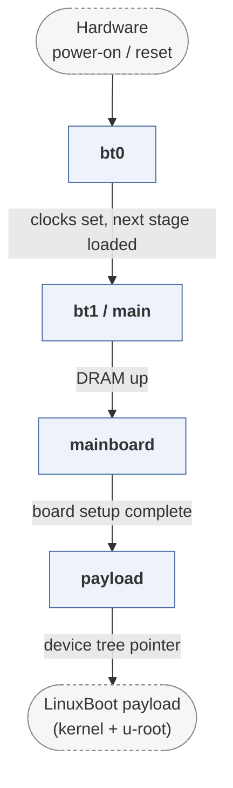

# oreboot

*coreboot rewritten in Rust, with no C.*

| | |
|---|---|
| Type | **Firmware bootloader** (type1) |
| Upstream | https://github.com/oreboot/oreboot |
| CVEs attributed | 0 |
| Vulnerability-fixing commits | 2 naming a CVE, 130 keyword-matched |
| CVEs with a linked fix | 0 |

## What it does at boot

Performs silicon init and hands to a payload, targeting RISC-V and ARM as well as x86.

## Why it is Type 1

Type 1: same role and payload handoff as coreboot, different language.

## How it boots

See [Boot-Stages](Boot-Stages) for the eight-stage model these phases map onto.



1. **bt0** -- First-stage ROM code in Rust: minimal clock and pin setup, enough to load the next stage.
2. **bt1 / main** -- Memory controller initialisation and the remaining platform bring-up.
3. **mainboard** -- Board-specific setup, then preparation of the payload environment.
4. **payload** -- Loads a LinuxBoot payload -- a Linux kernel with a u-root initramfs -- and jumps to it.

### Passing data between stages

oreboot is coreboot with the C removed, and it deliberately dropped coreboot's table-passing machinery along with it. Where coreboot builds a coreboot table for an arbitrary payload, oreboot targets LinuxBoot and passes what a Linux kernel expects: a device tree on ARM and RISC-V. Stage boundaries are Rust crates linked into separate images rather than modules dispatched at runtime.

### Handoff

The payload is a Linux kernel, entered with the architecture's normal boot protocol -- device tree pointer in the expected register. From there u-root's Go userland performs what a Type 2 bootloader would otherwise do, including kexec into the target kernel.

## Security mechanisms

Detected in its build configuration and source:

- fortify
- secure boot
- stack protector

See [Security-Mechanisms](Security-Mechanisms) for how these are detected and what a detection does and does not prove.

## Analysing it

```bash
git -C oss-bootloaders submodule update --init type1/oreboot
./scripts/analysis/run-tool.sh codeql oreboot
```

See [Tools](Tools) for what each tool applies to.

---

[Home](Home) · [Firmware bootloader](Bootloader-Types) · [Tools](Tools)
