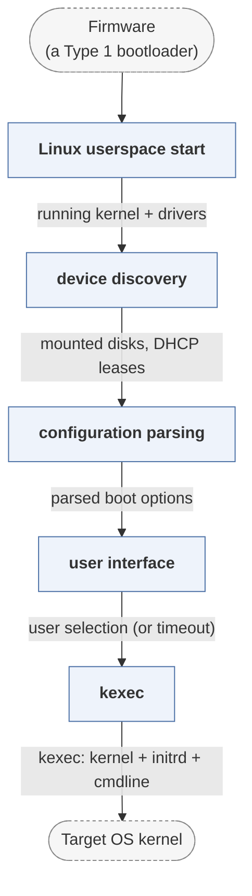

# petitboot

*kexec-based bootloader for OpenPOWER.*

| | |
|---|---|
| Type | **OS bootloader** (type2) |
| Upstream | https://github.com/open-power/petitboot |
| CVEs attributed | 0 |
| Vulnerability-fixing commits | 0 naming a CVE, 11 keyword-matched |
| CVEs with a linked fix | 0 |

## What it does at boot

Runs in a small Linux environment, discovers boot options and kexecs the target kernel.

## Why it is Type 2

Type 2: it runs on an initialised platform and its only job is launching an OS.

## How it boots

See [Boot-Stages](Boot-Stages) for the eight-stage model these phases map onto.



1. **Linux userspace start** -- Petitboot runs on a small Linux already booted by the platform firmware, so the kernel and drivers are in place before it starts.
2. **device discovery** -- udev events drive discovery: disks are mounted, network interfaces configured by DHCP.
3. **configuration parsing** -- Existing bootloader configurations found on those devices -- grub.cfg, syslinux.cfg, PXE config -- are parsed into boot options.
4. **user interface** -- An ncurses UI lists what was found, with a timeout for automatic boot.
5. **kexec** -- The chosen kernel and initrd are loaded and kexec replaces the running kernel.

### Passing data between stages

Petitboot inverts the usual arrangement: because a full Linux is already running, it does not need its own drivers, filesystem code or network stack, and hardware support is whatever the kernel supports. It communicates with the firmware beneath it through NVRAM variables -- on OpenPOWER, `petitboot,*` settings read and written through OPAL -- so choices persist across reboots. Its own daemon and UI talk over a local protocol, which is why the interface can be ncurses on a console or a remote client.

### Handoff

The transfer is `kexec`: the target kernel and initrd are loaded into memory, the purgatory code verifies them, and the running kernel is replaced in place without a firmware reset. The device tree is passed through, so the new kernel sees the same machine description skiboot built.

## Security mechanisms

Detected in its build configuration and source:

- rollback protection
- secure boot
- signature verification

See [Security-Mechanisms](Security-Mechanisms) for how these are detected and what a detection does and does not prove.

## Analysing it

```bash
git -C oss-bootloaders submodule update --init type2/petitboot
./scripts/analysis/run-tool.sh codeql petitboot
```

See [Tools](Tools) for what each tool applies to.

---

[Home](Home) · [OS bootloader](Bootloader-Types) · [Tools](Tools)
