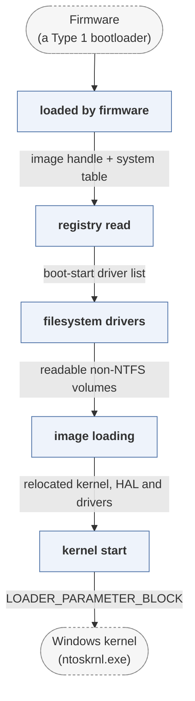

# quibble

*Open-source Windows boot loader replacement.*

| | |
|---|---|
| Type | **OS bootloader** (type2) |
| Upstream | https://github.com/maharmstone/quibble |
| CVEs attributed | 0 |
| Vulnerability-fixing commits | 0 naming a CVE, 0 keyword-matched |
| CVEs with a linked fix | 0 |

## What it does at boot

Loads the Windows kernel from a filesystem GRUB can reach.

## Why it is Type 2

Type 2: it prepares and launches an OS.

## How it boots

See [Boot-Stages](Boot-Stages) for the eight-stage model these phases map onto.



1. **loaded by firmware** -- quibble.efi is loaded from the ESP in place of bootmgfw.efi.
2. **registry read** -- Reads the SYSTEM hive to find the boot-start drivers and the services the kernel needs.
3. **filesystem drivers** -- Loads its own drivers -- Btrfs, ext, NTFS -- so Windows can be booted from filesystems the official loader does not support.
4. **image loading** -- Loads the kernel, HAL and boot drivers, relocating and linking them as the loader is required to.
5. **kernel start** -- Builds the loader block and enters the kernel.

### Passing data between stages

Quibble is a reimplementation of `bootmgfw.efi` and `winload.efi`, so the interface it must reproduce is the LOADER_PARAMETER_BLOCK: a large structure describing loaded modules, memory descriptors, the ARC device paths, registry data and the boot options the kernel expects to find. That structure changed across Windows versions, which is most of the difficulty -- the correct layout has to be produced for anything from XP to Windows 10 22H2. Boot configuration otherwise comes from the SYSTEM hive rather than from BCD.

### Handoff

Control passes to `ntoskrnl.exe` at its entry point with a pointer to the loader block, in the same state the Microsoft loader would have left. The project is explicitly a proof of concept, and its interest in this corpus is as an independent implementation of a closed handoff protocol.

## Security mechanisms

None detected. That means no matching pattern was found in its build configuration or source, not that the project is insecure -- a small MCU bootloader may simply have nothing to configure.

## Analysing it

```bash
git -C oss-bootloaders submodule update --init type2/quibble
./scripts/analysis/run-tool.sh codeql quibble
```

See [Tools](Tools) for what each tool applies to.

---

[Home](Home) · [OS bootloader](Bootloader-Types) · [Tools](Tools)
