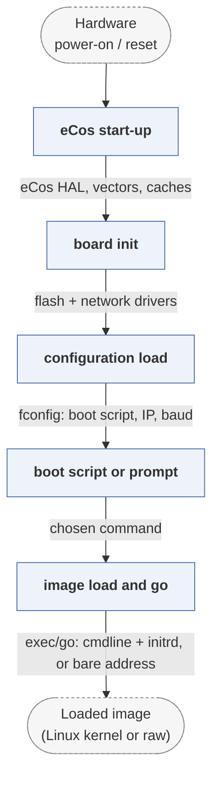

# redboot

*RedBoot, the eCos-based ROM monitor.*

| | |
|---|---|
| Type | **Monolithic bootloader** (type3) |
| Upstream | https://github.com/hharte/ecos |
| CVEs attributed | 0 |
| Vulnerability-fixing commits | 0 naming a CVE, 13 keyword-matched |
| CVEs with a linked fix | 0 |

## What it does at boot

Provides a debug monitor, flash management and network download, then boots an image.

## Why it is Type 3

Type 3: it owns the board from reset.

## How it boots

See [Boot-Stages](Boot-Stages) for the eight-stage model these phases map onto.



1. **eCos start-up** -- RedBoot is an eCos application, so the eCos HAL runs first: exception vectors, memory and cache setup.
2. **board init** -- Platform initialisation, then flash and network drivers are brought up.
3. **configuration load** -- Persistent configuration is read from the fconfig block in flash -- boot script, IP settings, console baud rate.
4. **boot script or prompt** -- A stored script runs after a timeout, or an interactive prompt is offered on the console or over telnet.
5. **image load and go** -- The image is loaded from flash, TFTP or serial, and `exec`/`go` transfers control.

### Passing data between stages

RedBoot's interface is the command monitor: `fis` manages the flash image system -- a simple table of named images in flash -- `fconfig` edits persistent settings, and `load` fetches images over TFTP, HTTP or X/Y-modem. It also implements the GDB remote protocol on the same console, so a developer can debug the loaded program through the bootloader. That combination of a network-reachable monitor and a debug stub in the boot path is what makes it interesting as an attack surface.

### Handoff

`exec` starts a Linux kernel with a command line and optional initrd, `go` jumps to an arbitrary loaded address. Since it is built on eCos, it can also simply be linked with the application it boots.

## Security mechanisms

Detected in its build configuration and source:

- stack protector

See [Security-Mechanisms](Security-Mechanisms) for how these are detected and what a detection does and does not prove.

## Analysing it

```bash
git -C oss-bootloaders submodule update --init type3/redboot
./scripts/analysis/run-tool.sh codeql redboot
```

See [Tools](Tools) for what each tool applies to.

---

[Home](Home) · [Monolithic bootloader](Bootloader-Types) · [Tools](Tools)
