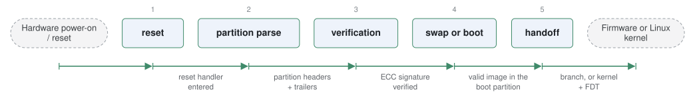

# rustBoot

*Secure bootloader for MCUs written in Rust.*

| | |
|---|---|
| Type | **Monolithic bootloader** (type3) |
| Upstream | https://github.com/nihalpasham/rustBoot |
| CVEs attributed | 0 |
| Vulnerability-fixing commits | 0 naming a CVE, 0 keyword-matched |
| CVEs with a linked fix | 0 |

## What it does at boot

Signature verification and A/B updates before jumping to the application.

## Why it is Type 3

Type 3: reset to application.

## How it boots

See [Boot-Stages](Boot-Stages) for the eight-stage model these phases map onto.



1. **reset** -- The MCU or SoC resets into rustBoot, written entirely in Rust.
2. **partition parse** -- Reads the boot and update partition headers and their trailers.
3. **verification** -- Checks the image digest and verifies its ECC signature using RustCrypto.
4. **swap or boot** -- Swaps partitions if an update is pending and confirmed-valid; otherwise boots the existing image.
5. **handoff** -- Jumps to the firmware image, or on Cortex-A loads and boots a Linux kernel.

### Passing data between stages

rustBoot uses the same multi-slot, trailer-driven state machine the C secure bootloaders use -- boot and update partitions, a state byte, a confirmation written by the running firmware -- but expresses the flash layout and the image format in Rust's type system so the parsing step cannot run off the end of a buffer. There is no runtime interface: everything is fixed at build time.

### Handoff

For bare-metal targets the handoff is the usual vector-table-and-branch. For Aarch64 Linux it loads the kernel and device tree and enters with the standard protocol, which is why it appears as a Type 3 bootloader spanning both roles on those boards.

## Security mechanisms

Detected in its build configuration and source:

- rollback protection

See [Security-Mechanisms](Security-Mechanisms) for how these are detected and what a detection does and does not prove.

## Analysing it

```bash
git -C oss-bootloaders submodule update --init type3/rustBoot
./scripts/analysis/run-tool.sh codeql rustBoot
```

See [Tools](Tools) for what each tool applies to.

---

[Home](Home) · [Monolithic bootloader](Bootloader-Types) · [Tools](Tools)
