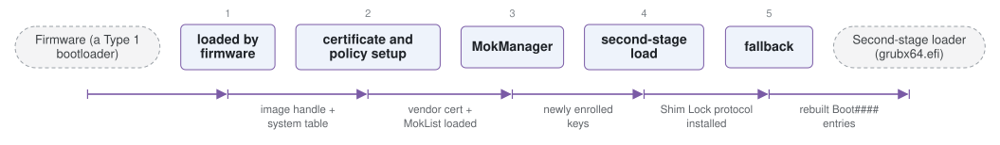

# shim

*Signed first-stage UEFI loader that extends Secure Boot to distro keys.*

| | |
|---|---|
| Type | **OS bootloader** (type2) |
| Upstream | https://github.com/rhboot/shim |
| CVEs attributed | 35 |
| Vulnerability-fixing commits | 15 naming a CVE, 19 keyword-matched |
| CVEs with a linked fix | 24 |

## What it does at boot

Verifies and loads the next stage (usually GRUB) against its own key database and SBAT revocation levels.

## Why it is Type 2

Type 2: it runs on top of UEFI firmware and exists solely to get an OS loader trusted and running.

## How it boots

See [Boot-Stages](Boot-Stages) for the eight-stage model these phases map onto.



1. **loaded by firmware** -- The firmware's BDS phase loads shimx64.efi, which is signed by a key already in the platform's db.
2. **certificate and policy setup** -- shim installs its own verification protocol and reads MokList, MokListX and the built-in vendor certificate.
3. **MokManager** -- If enrolment is pending, MokManager.efi runs first so the user can approve a key or hash at the console.
4. **second-stage load** -- Verifies and loads the real bootloader -- usually grubx64.efi -- from the same directory.
5. **fallback** -- If no boot variable points anywhere valid, fallback.efi rebuilds the Boot#### entries from BOOTX64.CSV.

### Passing data between stages

shim exists to move the trust decision out of the firmware's key database and into one the distribution controls. It passes its verification service forward by installing the Shim Lock protocol into the UEFI handle database, so the loader it starts -- and the Linux kernel after that -- can ask shim to verify an image against the vendor certificate or the Machine Owner Key list instead of against the firmware's db. Those MOK lists live in UEFI variables, written only through MokManager at the console, which is what keeps a running OS from silently enrolling its own key.

### Handoff

shim loads the next binary with the ordinary UEFI image services and calls it with the same system table it was given, so from the second-stage loader's point of view nothing has changed except that a verification protocol is now available. Control continues to GRUB, which starts the kernel; the kernel's lockdown mode then consults shim's variables to decide whether Secure Boot is in force.

## Attack surfaces seen in its CVEs

| Surface | | CVEs |
|---|---|---:|
| `SAS1` | Remote access (software) | 8 |
| `SAS2` | Persistent data source (software) | 1 |
| `SAS4` | Boot-time features (software) | 1 |

## Most common weaknesses

| CWE | CVEs |
|---|---:|
| CWE-125 | 3 |
| CWE-347 | 2 |
| CWE-1321 | 2 |
| CWE-476 | 2 |
| CWE-669 | 1 |
| CWE-787 | 1 |
| CWE-190 | 1 |
| CWE-324 | 1 |

## Security mechanisms

Detected in its build configuration and source:

- encryption
- measured boot
- rollback protection
- secure boot
- signature verification

See [Security-Mechanisms](Security-Mechanisms) for how these are detected and what a detection does and does not prove.

## Reproducible vulnerabilities

Each of these resolves to a fixing commit and to the parent revision that still contains the bug:

| CVE | Fix | Vulnerable revision |
|---|---|---|
| CVE-2021-3695 | `9a09faf390` | `80e34fc3d5` |
| CVE-2022-28737 | `159151b664` | `9a09faf390` |
| CVE-2022-28737 | `9a09faf390` | `80e34fc3d5` |
| CVE-2022-28737 | `e99bdbb827` | `77144e5a40` |
| CVE-2023-40546 | `5914984a1f` | `1770a03423` |
| CVE-2023-40546 | `dae82f6bd7` | `96dccc255b` |
| CVE-2023-40546 | `66e6579dbf` | `7ba7440c49` |
| CVE-2023-40547 | `5914984a1f` | `1770a03423` |
| CVE-2023-40547 | `57c0eedfa1` | `6f0c8d2c92` |
| CVE-2023-40547 | `0226b56513` | `e801b0d61f` |
| CVE-2023-40548 | `5914984a1f` | `1770a03423` |
| CVE-2023-40548 | `96dccc255b` | `afdc5039de` |
| CVE-2023-40549 | `5914984a1f` | `1770a03423` |
| CVE-2023-40549 | `afdc5039de` | `e7f5fdf53e` |
| CVE-2023-40550 | `5914984a1f` | `1770a03423` |
| … and 9 more | | |

```bash
git -C oss-bootloaders/type2/shim checkout <vulnerable revision>
```

## Analysing it

```bash
git -C oss-bootloaders submodule update --init type2/shim
./scripts/analysis/run-tool.sh codeql shim
```

See [Tools](Tools) for what each tool applies to.

---

[Home](Home) · [OS bootloader](Bootloader-Types) · [Tools](Tools)
