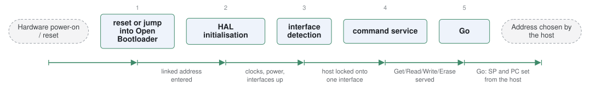

# stm32-mw-openbl

*STMicroelectronics OpenBootLoader middleware.*

| | |
|---|---|
| Type | **Monolithic bootloader** (type3) |
| Upstream | https://github.com/STMicroelectronics/stm32-mw-openbl |
| CVEs attributed | 0 |
| Vulnerability-fixing commits | 0 naming a CVE, 0 keyword-matched |
| CVEs with a linked fix | 0 |

## What it does at boot

Reimplements the STM32 system bootloader protocol in open source.

## Why it is Type 3

Type 3: the in-ROM-equivalent stage that owns the MCU from reset.

## How it boots

See [Boot-Stages](Boot-Stages) for the eight-stage model these phases map onto.



1. **reset or jump into Open Bootloader** -- Runs from wherever it was linked in user flash, having been started at reset or jumped to by the application.
2. **HAL initialisation** -- Brings up clocks, power and the configured interfaces through STM32Cube HAL/LL drivers.
3. **interface detection** -- Waits for a host on USART, I2C, SPI, USB-DFU or FDCAN and locks onto the first that speaks.
4. **command service** -- Serves the ST system bootloader command set -- Get, Read Memory, Write Memory, Erase, Go, and the protection commands.
5. **Go** -- The Go command transfers control to an address the host specifies.

### Passing data between stages

Open Bootloader is deliberately protocol-compatible with the system bootloader in STM32 ROM, so STM32CubeProgrammer and any tool written against AN3155 work unchanged -- the communication contract is ST's published command set rather than anything new. It runs in the non- secure domain and relies on flash write protection to keep itself from being overwritten by its own commands.

### Handoff

The `Go` command sets the stack pointer and program counter from the address given and branches, so what the application receives is whatever the host chose. That is the intended flexibility and also the reason it belongs behind readout and write protection: a reachable Open Bootloader is an arbitrary read/write/execute interface to the device.

## Security mechanisms

None detected. That means no matching pattern was found in its build configuration or source, not that the project is insecure -- a small MCU bootloader may simply have nothing to configure.

## Analysing it

```bash
git -C oss-bootloaders submodule update --init type3/stm32-mw-openbl
./scripts/analysis/run-tool.sh codeql stm32-mw-openbl
```

See [Tools](Tools) for what each tool applies to.

---

[Home](Home) · [Monolithic bootloader](Bootloader-Types) · [Tools](Tools)
