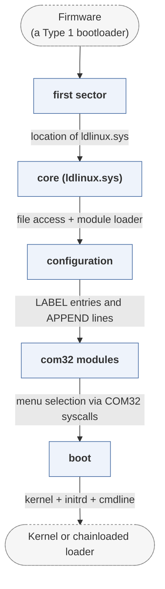

# syslinux

*SYSLINUX family: SYSLINUX, ISOLINUX, PXELINUX, EXTLINUX.*

| | |
|---|---|
| Type | **OS bootloader** (type2) |
| Upstream | https://repo.or.cz/syslinux |
| CVEs attributed | 0 |
| Vulnerability-fixing commits | 0 naming a CVE, 25 keyword-matched |
| CVEs with a linked fix | 0 |

## What it does at boot

Boots Linux from FAT, ISO9660, network or ext filesystems, driven by a config file.

## Why it is Type 2

Type 2: configuration-driven OS loading from an initialised machine.

## How it boots

See [Boot-Stages](Boot-Stages) for the eight-stage model these phases map onto.



1. **first sector** -- SYSLINUX, EXTLINUX and ISOLINUX each install a small loader in the volume boot record or boot image; PXELINUX is fetched over TFTP instead.
2. **core (ldlinux.sys)** -- The core module is loaded next and provides file access, memory management and the module loader.
3. **configuration** -- syslinux.cfg (or a PXE-specific path derived from the MAC or IP) is read and its LABEL entries become menu items.
4. **com32 modules** -- Modules such as menu.c32, vesamenu.c32 and chain.c32 extend the loader with menus, chainloading and hardware probing.
5. **boot** -- The selected kernel is loaded, or another bootloader is chainloaded.

### Passing data between stages

Each SYSLINUX variant differs only in how it reads files -- FAT, ext, ISO 9660, or TFTP -- and presents the same interface above that, which is why one configuration format serves all four. Modules are COM32 executables that call back into the core through a documented syscall table, so a menu module can list files, read the configuration and then load a kernel without linking against the core. PXELINUX additionally keeps the DHCP packet available so scripts can key on the client's identity.

### Handoff

For Linux it loads the kernel and initrd, builds the command line from the LABEL's APPEND line, and enters through the standard x86 boot protocol. `chain.c32` instead loads another boot sector -- the usual route to the Windows boot manager. MEMDISK is the unusual case: it loads a whole floppy or disk image into memory and hooks INT 0x13 so a legacy OS boots from what it believes is real hardware.

## Security mechanisms

Detected in its build configuration and source:

- fortify

See [Security-Mechanisms](Security-Mechanisms) for how these are detected and what a detection does and does not prove.

## Analysing it

```bash
git -C oss-bootloaders submodule update --init type2/syslinux
./scripts/analysis/run-tool.sh codeql syslinux
```

See [Tools](Tools) for what each tool applies to.

---

[Home](Home) · [OS bootloader](Bootloader-Types) · [Tools](Tools)
