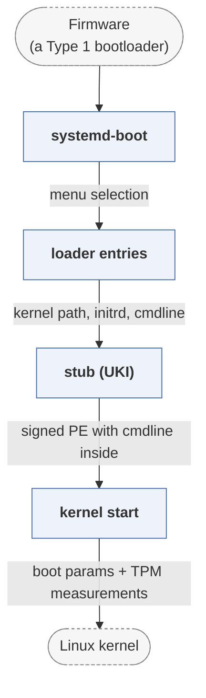

# systemd

*systemd, whose systemd-boot is a minimal UEFI boot manager.*

| | |
|---|---|
| Type | **OS bootloader** (type2) |
| Upstream | https://github.com/systemd/systemd |
| CVEs attributed | 2 |
| Vulnerability-fixing commits | 23 naming a CVE, 312 keyword-matched |
| CVEs with a linked fix | 0 |

## What it does at boot

Enumerates boot entries from the EFI System Partition and launches the chosen kernel, with no scripting language.

## Why it is Type 2

Type 2: a UEFI application that selects and starts an OS.

## How it boots

See [Boot-Stages](Boot-Stages) for the eight-stage model these phases map onto.



1. **systemd-boot** -- A UEFI boot manager loaded by the firmware. It reads loader entries from the ESP and presents a menu.
2. **loader entries** -- Plain text files under /loader/entries name a kernel, an initrd and a command line, or a single unified kernel image.
3. **stub (UKI)** -- systemd-stub is linked into a unified kernel image so the kernel, initrd, command line and signature ship as one signed PE binary.
4. **kernel start** -- The chosen kernel is loaded and entered through the EFI stub.

### Passing data between stages

systemd-boot deliberately does nothing the firmware already does: it has no filesystem drivers of its own and reads only the FAT ESP the firmware can already see. State passes as UEFI variables in the vendor GUID `4a67b082-0a4c-41cf-b6c7-440b29bb8c4f` -- `LoaderEntryDefault`, `LoaderEntryOneShot` for a single alternate boot, `LoaderTimeInitUSec` for the timing the OS later reports -- so `bootctl` in userspace and the boot manager agree without a private configuration format. A unified kernel image goes further and removes the gap entirely: because the command line is inside the signed PE image, it cannot be edited between verification and use.

### Handoff

The kernel is started through the EFI stub with the boot parameters the entry specified, and `ExitBootServices()` is called by the stub. systemd-stub additionally passes the initrd and any addons through the LINUX_INITRD_MEDIA device path protocol, and measures what it loaded into the TPM so the sequence can be attested afterwards.

## Attack surfaces seen in its CVEs

| Surface | | CVEs |
|---|---|---:|
| `SAS2` | Persistent data source (software) | 1 |

## Most common weaknesses

| CWE | CVEs |
|---|---:|
| CWE-522 | 1 |

## Security mechanisms

Detected in its build configuration and source:

- measured boot
- rollback protection
- secure boot
- signature verification
- stack protector

See [Security-Mechanisms](Security-Mechanisms) for how these are detected and what a detection does and does not prove.

## Analysing it

```bash
git -C oss-bootloaders submodule update --init type2/systemd
./scripts/analysis/run-tool.sh codeql systemd
```

See [Tools](Tools) for what each tool applies to.

---

[Home](Home) · [OS bootloader](Bootloader-Types) · [Tools](Tools)
