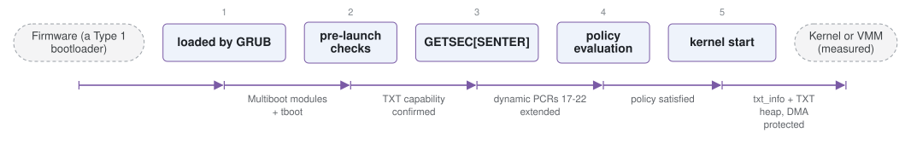

# tboot-mirror

*Trusted Boot, a pre-kernel module for Intel TXT measured launch.*

| | |
|---|---|
| Type | **OS bootloader** (type2) |
| Upstream | https://github.com/BreakingBoot/tboot-mirror |
| CVEs attributed | 3 |
| Vulnerability-fixing commits | 0 naming a CVE, 19 keyword-matched |
| CVEs with a linked fix | 0 |

## What it does at boot

Performs a measured launch of the kernel or hypervisor using TXT and the TPM.

## Why it is Type 2

Type 2: it sits between firmware and the OS, measuring and launching it.

## How it boots

See [Boot-Stages](Boot-Stages) for the eight-stage model these phases map onto.



1. **loaded by GRUB** -- tboot is loaded as a Multiboot module ahead of the kernel or hypervisor it will measure.
2. **pre-launch checks** -- Verifies TXT capability, the chipset, and that the SINIT ACM matches the platform.
3. **GETSEC[SENTER]** -- Executes the measured launch: the CPU and chipset reset the dynamic PCRs, the ACM is verified by microcode, and it measures the MLE.
4. **policy evaluation** -- The launch control policy and verified launch policy are checked against measurements of the kernel and its modules.
5. **kernel start** -- If policy is satisfied, the kernel or VMM is started in the measured environment.

### Passing data between stages

tboot's communication is with the TPM rather than with the next stage. The dynamic PCRs (17-22) are reset by the SENTER instruction and extended with measurements of the ACM, tboot itself, and each module it was given; policies are stored in TPM NVRAM so they cannot be swapped along with the disk image. What tboot passes forward to the OS is a `txt_info` structure and the TXT heap, telling the kernel it was launched measured and where the protected regions are.

### Handoff

Control reaches the kernel or hypervisor through the normal Multiboot handoff, but in a machine state SENTER established: DMA protection is in place for the measured regions and the dynamic root of trust has been recorded. A later attestation verifies the PCR values rather than trusting the boot chain to have been honest.

## Security mechanisms

Detected in its build configuration and source:

- fortify
- measured boot
- rollback protection

See [Security-Mechanisms](Security-Mechanisms) for how these are detected and what a detection does and does not prove.

## Analysing it

```bash
git -C oss-bootloaders submodule update --init type2/tboot-mirror
./scripts/analysis/run-tool.sh codeql tboot-mirror
```

See [Tools](Tools) for what each tool applies to.

---

[Home](Home) · [OS bootloader](Bootloader-Types) · [Tools](Tools)
