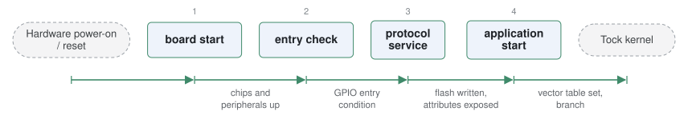

# tock-bootloader

*Bootloader for the Tock embedded OS.*

| | |
|---|---|
| Type | **Monolithic bootloader** (type3) |
| Upstream | https://github.com/tock/tock-bootloader |
| CVEs attributed | 0 |
| Vulnerability-fixing commits | 0 naming a CVE, 0 keyword-matched |
| CVEs with a linked fix | 0 |

## What it does at boot

Flashes and verifies Tock applications over serial before starting the kernel.

## Why it is Type 3

Type 3: reset to application.

## How it boots

See [Boot-Stages](Boot-Stages) for the eight-stage model these phases map onto.



1. **board start** -- The bootloader is itself a Tock kernel image: the board file initialises chips, peripherals and the kernel.
2. **entry check** -- Checks the bootloader entry condition -- typically a GPIO held at reset -- to decide whether to run or pass through.
3. **protocol service** -- Serves the Tock bootloader protocol over UART or USB CDC: read, write, erase, get attributes.
4. **application start** -- Jumps to the main Tock kernel image.

### Passing data between stages

Because it is built on Tock itself, the bootloader reuses the kernel's driver and capsule infrastructure rather than reimplementing it. Its protocol is a simple framed command set that `tockloader` speaks, with an attribute table stored in flash holding board name, architecture and application addresses -- so the host tool discovers the flash layout from the device instead of being configured for it.

### Handoff

Control passes to the real kernel image by the usual vector-table-and-branch. The design point of interest is that the bootloader is a full kernel: the isolation properties Tock provides for applications are available to the update path as well.

## Security mechanisms

None detected. That means no matching pattern was found in its build configuration or source, not that the project is insecure -- a small MCU bootloader may simply have nothing to configure.

## Analysing it

```bash
git -C oss-bootloaders submodule update --init type3/tock-bootloader
./scripts/analysis/run-tool.sh codeql tock-bootloader
```

See [Tools](Tools) for what each tool applies to.

---

[Home](Home) · [Monolithic bootloader](Bootloader-Types) · [Tools](Tools)
