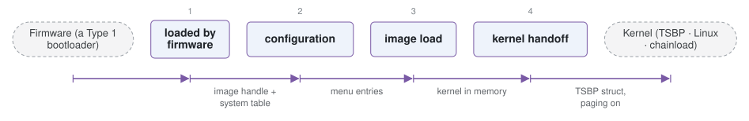

# tosaithe

*Minimal UEFI boot menu and Stivale2 loader.*

| | |
|---|---|
| Type | **OS bootloader** (type2) |
| Upstream | https://github.com/davmac314/tosaithe |
| CVEs attributed | 0 |
| Vulnerability-fixing commits | 0 naming a CVE, 0 keyword-matched |
| CVEs with a linked fix | 0 |

## What it does at boot

Boots hobby-OS kernels from UEFI.

## Why it is Type 2

Type 2: a UEFI application that loads a kernel.

## How it boots

See [Boot-Stages](Boot-Stages) for the eight-stage model these phases map onto.



1. **loaded by firmware** -- A UEFI application started from the ESP.
2. **configuration** -- Reads its menu configuration and presents entries.
3. **image load** -- Loads a Linux kernel, chainloads another EFI program, or loads a TSBP kernel.
4. **kernel handoff** -- Enters the kernel according to the protocol it uses.

### Passing data between stages

Tosaithe is small and UEFI-only by design, and exists mainly as the reference implementation of the Tosaithe Boot Protocol. Under TSBP the loader passes a single structure describing the memory map, framebuffer, ACPI and the loaded kernel's own segments, with the page tables already established -- the same philosophy as Limine's, with a smaller surface.

### Handoff

For a TSBP kernel it enters 64-bit mode with mappings in place and the information structure in a defined register, after calling `ExitBootServices()`. For Linux it uses the EFI stub path, and for a chainload it simply starts another EFI image.

## Security mechanisms

None detected. That means no matching pattern was found in its build configuration or source, not that the project is insecure -- a small MCU bootloader may simply have nothing to configure.

## Analysing it

```bash
git -C oss-bootloaders submodule update --init type2/tosaithe
./scripts/analysis/run-tool.sh codeql tosaithe
```

See [Tools](Tools) for what each tool applies to.

---

[Home](Home) · [OS bootloader](Bootloader-Types) · [Tools](Tools)
