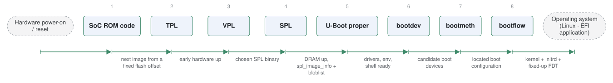

# u-boot

*Das U-Boot, the dominant embedded bootloader.*

| | |
|---|---|
| Type | **Monolithic bootloader** (type3) |
| Upstream | https://github.com/u-boot/u-boot |
| CVEs attributed | 70 |
| Vulnerability-fixing commits | 46 naming a CVE, 428 keyword-matched |
| CVEs with a linked fix | 39 |

## What it does at boot

SPL performs DRAM and clock init from reset, then full U-Boot loads a kernel, device tree and initrd, with a command shell and scripting throughout.

## Why it is Type 3

Type 3: SPL plus U-Boot together take the board from reset to a running OS with no separate firmware layer -- one project spans both roles.

## How it boots

The SoK paper gives a full case study of this bootloader in section 3.7. See [Boot-Stages](Boot-Stages) for the eight-stage model these phases map onto.



1. **SoC ROM code** -- OEM code in mask ROM runs from the reset vector and does the minimum needed to load the next image, often from a fixed offset on eMMC or SPI flash.
2. **TPL** -- Optional tertiary program loader: very early hardware setup, used where the ROM can only load a very small image. Loads SPL or VPL.
3. **VPL** -- Optional verification program loader, which selects among multiple verified SPL binaries.
4. **SPL** -- Secondary program loader. Initialises DRAM and loads full U-Boot into it -- or, in Falcon mode, loads the Linux kernel directly and skips the rest.
5. **U-Boot proper** -- The full image: driver model, filesystems, network stack, environment and the command shell.
6. **bootdev** -- Abstracts the device that may hold an OS -- MMC, USB, NVMe, network.
7. **bootmeth** -- Defines how each bootdev is searched for a valid boot configuration -- extlinux.conf, an EFI application, a script.
8. **bootflow** -- The concrete sequence produced by a bootmeth on a bootdev. The first valid one found is used by default.

### Passing data between stages

Because the stages are separate images built from one tree, U-Boot passes state forward explicitly: SPL hands U-Boot a `struct spl_image_info`, and where the same information must survive from before DRAM exists it travels in a bloblist -- a relocatable container that also carries ACPI tables, the device tree and SMBIOS data between stages. The persistent interface is the environment: a key-value store in flash (`bootargs`, `bootcmd`, `fdt_addr`) readable and writable from the shell and by scripts, which is how a bootflow is altered without rebuilding. U-Boot can also present itself as UEFI, publishing Boot and Runtime Services so a standard distribution loader runs unmodified.

### Handoff

The OS is started with the architecture's boot protocol, and the important thing passed is the flattened device tree: U-Boot may fix it up first -- inserting the MAC address, memory size, or kernel command line -- so the kernel sees a description matched to the actual board. An extlinux.conf-driven bootflow supplies the kernel, the command line, the device tree directory and the initrd, as in the paper's Listing 2. Changing anything more than the bootflow generally means reflashing.

## Attack surfaces seen in its CVEs

| Surface | | CVEs |
|---|---|---:|
| `SAS2` | Persistent data source (software) | 20 |
| `SAS1` | Remote access (software) | 6 |
| `HAS2` | External hardware (hardware) | 1 |
| `HAS1` | Invasive hardware (hardware) | 1 |

## Most common weaknesses

| CWE | CVEs |
|---|---:|
| CWE-190 | 6 |
| CWE-329 | 2 |
| CWE-122 | 2 |
| CWE-798 | 2 |
| CWE-20 | 2 |
| CWE-120 | 2 |
| CWE-284 | 1 |
| CWE-77 | 1 |

## Security mechanisms

Detected in its build configuration and source:

- fortify
- measured boot
- rollback protection
- secure boot
- signature verification
- stack protector

See [Security-Mechanisms](Security-Mechanisms) for how these are detected and what a detection does and does not prove.

## Reproducible vulnerabilities

Each of these resolves to a fixing commit and to the parent revision that still contains the bug:

| CVE | Fix | Vulnerable revision |
|---|---|---|
| CVE-2017-3225 | `5eb35220b2` | `0683fb7242` |
| CVE-2017-3226 | `5eb35220b2` | `0683fb7242` |
| CVE-2018-18439 | `9cc2323fee` | `e3b4fc9598` |
| CVE-2018-18439 | `67bb984249` | `1a4af5c562` |
| CVE-2018-18439 | `e964df1e2a` | `aac0c29d4b` |
| CVE-2018-18439 | `a156c47e39` | `a85c213f47` |
| CVE-2018-18440 | `e964df1e2a` | `aac0c29d4b` |
| CVE-2018-18440 | `aa3c609e2b` | `4cc8af8037` |
| CVE-2019-13103 | `232e2f4fd9` | `1493b140e4` |
| CVE-2019-13104 | `878269dbe7` | `6e5a79de65` |
| CVE-2019-13105 | `6e5a79de65` | `232e2f4fd9` |
| CVE-2019-13106 | `e205896c53` | `084be43b75` |
| CVE-2019-14192 | `fe7288069d` | `12c2a310e8` |
| CVE-2019-14193 | `fe7288069d` | `12c2a310e8` |
| CVE-2019-14194 | `aa207cf3a6` | `741a8a08eb` |
| … and 24 more | | |

```bash
git -C oss-bootloaders/type3/u-boot checkout <vulnerable revision>
```

## Analysing it

```bash
git -C oss-bootloaders submodule update --init type3/u-boot
./scripts/analysis/run-tool.sh codeql u-boot
```

See [Tools](Tools) for what each tool applies to.

---

[Home](Home) · [Monolithic bootloader](Bootloader-Types) · [Tools](Tools)
