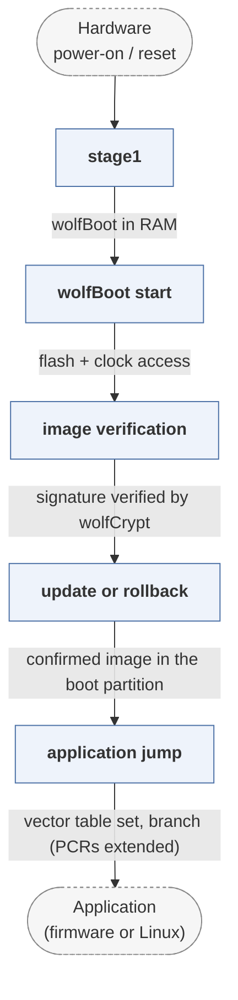

# wolfBoot

*Portable secure bootloader from wolfSSL.*

| | |
|---|---|
| Type | **Monolithic bootloader** (type3) |
| Upstream | https://github.com/wolfSSL/wolfBoot |
| CVEs attributed | 0 |
| Vulnerability-fixing commits | 0 naming a CVE, 2 keyword-matched |
| CVEs with a linked fix | 0 |

## What it does at boot

Verifies firmware signatures with wolfCrypt, supports rollback protection and encrypted updates, then boots the application.

## Why it is Type 3

Type 3: MCU-class reset-to-application boot.

## How it boots

See [Boot-Stages](Boot-Stages) for the eight-stage model these phases map onto.



1. **stage1** -- On platforms that need it, a minimal first stage loads wolfBoot itself from flash into RAM.
2. **wolfBoot start** -- Minimal HAL initialisation -- clock, flash access -- and nothing more.
3. **image verification** -- Parses the image header, checks the SHA digest and verifies the signature with wolfCrypt, against a public key compiled into the bootloader.
4. **update or rollback** -- If the update partition holds a newer verified image, the partitions are swapped through the sector-based swap area; a failed confirmation triggers rollback.
5. **application jump** -- Sets the vector table and jumps to the verified image.

### Passing data between stages

wolfBoot follows RFC 9019, and its state is the partition trailer: magic, partition state (`NEW`, `UPDATING`, `TESTING`, `SUCCESS`) and the sector flags recording swap progress, so an interrupted update resumes. Version monotonicity is enforced from the signed header, optionally anchored in a TPM or in one-time-programmable memory to make rollback impossible rather than merely discouraged. A running application signals success by writing the trailer through the same API.

### Handoff

The jump to the application passes nothing beyond the hardware state. On platforms with a TPM, measurements are extended into PCRs first, so the application can attest to what booted it. wolfBoot can also chain into Linux on larger targets, where it fills the role a Type 1 stage would otherwise have.

## Security mechanisms

Detected in its build configuration and source:

- aslr
- encryption
- fortify
- measured boot
- rollback protection
- secure boot
- signature verification
- stack protector

See [Security-Mechanisms](Security-Mechanisms) for how these are detected and what a detection does and does not prove.

## Analysing it

```bash
git -C oss-bootloaders submodule update --init type3/wolfBoot
./scripts/analysis/run-tool.sh codeql wolfBoot
```

See [Tools](Tools) for what each tool applies to.

---

[Home](Home) · [Monolithic bootloader](Bootloader-Types) · [Tools](Tools)
