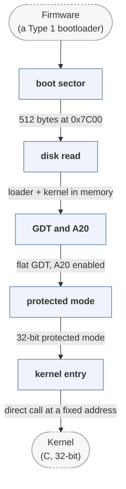

# x86-bootloader

*Teaching-scale x86 bootloader.*

| | |
|---|---|
| Type | **OS bootloader** (type2) |
| Upstream | https://github.com/lukearend/x86-bootloader |
| CVEs attributed | 0 |
| Vulnerability-fixing commits | 0 naming a CVE, 0 keyword-matched |
| CVEs with a linked fix | 0 |

## What it does at boot

A minimal MBR loader demonstrating the real-mode to protected-mode transition.

## Why it is Type 2

Type 2: it starts after BIOS and loads a kernel.

## How it boots

See [Boot-Stages](Boot-Stages) for the eight-stage model these phases map onto.



1. **boot sector** -- 512 bytes loaded by BIOS to 0x7C00, ending in the 0xAA55 signature.
2. **disk read** -- Uses INT 0x13 to read the rest of the loader and the kernel off the disk.
3. **GDT and A20** -- Sets up a flat global descriptor table and enables the A20 line.
4. **protected mode** -- Sets the PE bit in CR0 and far-jumps to flush the pipeline into 32-bit code.
5. **kernel entry** -- Calls into the C kernel it loaded.

### Passing data between stages

This is a teaching implementation, so the mechanisms are the bare ones: BIOS interrupts for disk and screen while still in real mode, and fixed load addresses agreed between the assembly stub and the linker script. There is no configuration file and no negotiated structure -- the contract between stages is the memory map written in the source.

### Handoff

The kernel is entered by a direct call once protected mode is on. Its value in this corpus is that the whole Type 2 skeleton -- sector load, mode switch, jump -- is small enough to read in one sitting, which makes it useful for teaching the shape that the production loaders elaborate on.

## Security mechanisms

None detected. That means no matching pattern was found in its build configuration or source, not that the project is insecure -- a small MCU bootloader may simply have nothing to configure.

## Analysing it

```bash
git -C oss-bootloaders submodule update --init type2/x86-bootloader
./scripts/analysis/run-tool.sh codeql x86-bootloader
```

See [Tools](Tools) for what each tool applies to.

---

[Home](Home) · [OS bootloader](Bootloader-Types) · [Tools](Tools)
